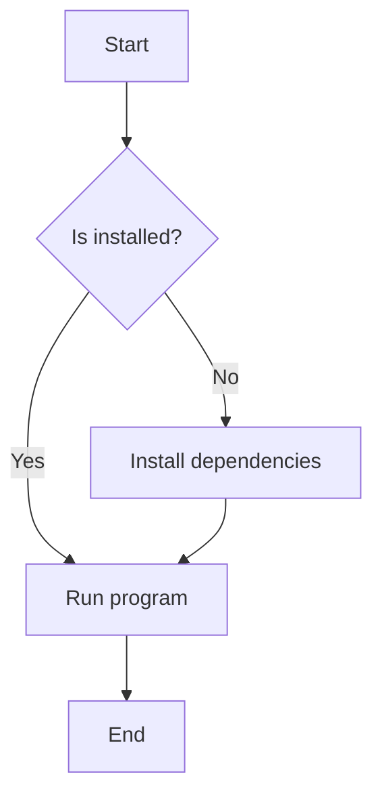
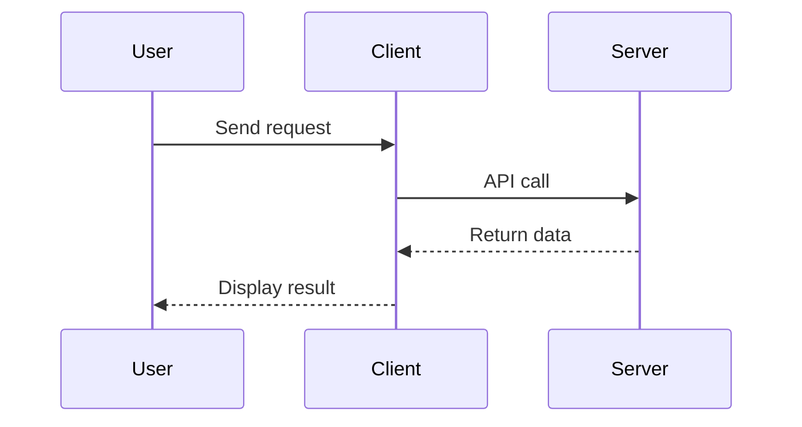
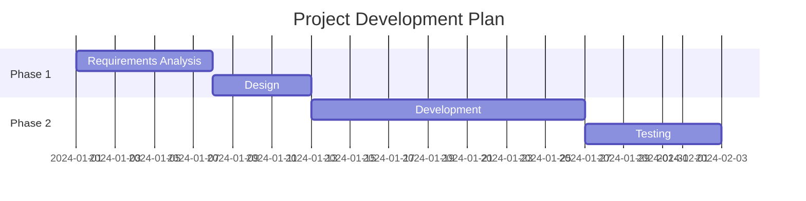
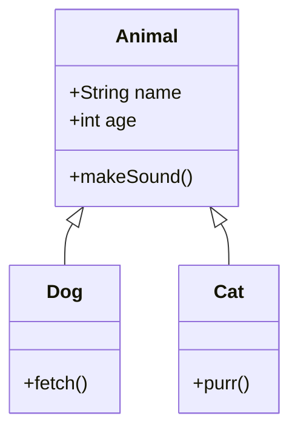

# Chapter 15: README and Project Documentation Writing Guide

> Good documentation is half the success of a project. This chapter will comprehensively introduce how to write professional README and project documentation on GitHub.

---

## Table of Contents

- [15.1 Importance of README](#151-importance-of-readme)
- [15.2 README Basic Structure](#152-readme-basic-structure)
- [15.3 Markdown Syntax Details](#153-markdown-syntax-details)
- [15.4 Advanced Markdown Techniques](#154-advanced-markdown-techniques)
- [15.5 Badge Usage Guide](#155-badge-usage-guide)
- [15.6 Project Documentation Structure Design](#156-project-documentation-structure-design)
- [15.7 API Documentation Generation](#157-api-documentation-generation)
- [15.8 Contributing Guide Writing](#158-contributing-guide-writing)
- [15.9 Changelog Specification](#159-changelog-specification)
- [15.10 License Selection Guide](#1510-license-selection-guide)
- [15.11 Code of Conduct](#1511-code-of-conduct)
- [15.12 Bilingual README Best Practices](#1512-bilingual-readme-best-practices)
- [15.13 README Templates and Examples](#1513-readme-templates-and-examples)
- [15.14 Documentation Automation Tools](#1514-documentation-automation-tools)
- [15.15 Chinese Project Documentation Writing Standards](#1515-chinese-project-documentation-writing-standards)

---

## 15.1 Importance of README

### 15.1.1 First Impression Determines Everything

On GitHub, README file is the first content visitors see. Research shows that when users visit a new project, they only spend an average of **7 seconds** deciding whether to continue learning about this project. This means your README must capture readers' attention within these few short seconds.

An excellent README can:

- **Attract contributors**: Clear project description and contribution guidelines will make more developers willing to participate
- **Lower usage barrier**: Detailed installation and usage instructions let users get started quickly
- **Establish professional image**: Standardized documentation reflects project maturity and maintainer's professional attitude
- **Improve SEO effect**: GitHub search engine will index README content, good documentation can increase project exposure
- **Reduce repeated problems**: Complete documentation can answer most common questions, reducing maintainer burden

### 15.1.2 Project Facade Function

Think of README as your project's "facade". Just like a store's window display, README needs to:

1. **Clearly convey value**: Users should understand what this project can do within a few seconds
2. **Show project status**: Through badges, display build status, version number, test coverage, etc.
3. **Provide quick entry**: Let users quickly install and experience the project
4. **Build trust**: Show active community, timely maintenance and professional attitude

### 15.1.3 Negative Case Analysis

The following is a typical poor README:

```markdown
# My Project

This is my project.

Usage: see code.
```

**Problem Analysis:**
- No project description, users don't know what this is
- No installation instructions, users cannot use it
- No example code, users don't know how to start
- No license, users don't know if they can use it

---

## 15.2 README Basic Structure

### 15.2.1 Standard Structure Overview

A complete README usually contains the following parts:

```markdown
# Project Name

> One sentence brief description

[Badge Area]

## 📖 Introduction

Detailed project introduction...

## ✨ Features

- Feature one
- Feature two

## 🚀 Quick Start

### Installation

### Usage

## 📚 Documentation

## 🤝 Contributing

## 📄 License

## 🙏 Acknowledgments
```

### 15.2.2 Detailed Description of Each Part

**Title (Project Name)**

Title should be concise and clear, using level one heading (`#`). If project has brand name, can add Logo:

```markdown
<div align="center">
  
  <h1>ProjectName</h1>
  <p>Concise and powerful project description</p>
</div>
```

**Project Description**

Description should answer the following questions:
- What is this project?
- What problem does it solve?
- What's unique about it?

```markdown
## 📖 Introduction

ProjectName is a high-performance data processing framework written in Python. It can help developers
quickly process large-scale datasets, supporting parallel computing and distributed processing.

**Why choose ProjectName?**
- 🚀 10x faster than traditional solutions
- 🎯 Simple API design
- 🔌 Rich plugin ecosystem
```

**Installation Instructions**

Provide multiple installation methods to cover different user needs:

```markdown
## 🚀 Installation

### Install using pip (Recommended)

```bash
pip install projectname
```

### Install from source

```bash
git clone https://github.com/username/projectname.git
cd projectname
pip install -e .
```

### Using Docker

```bash
docker pull username/projectname:latest
docker run -p 8080:8080 username/projectname
```

**Usage Examples**

Provide clear code examples to let users get started quickly:

```markdown
## 💻 Usage Examples

### Basic Usage

```python
from projectname import Processor

# Create processor instance
processor = Processor()

# Process data
result = processor.process(data)
print(result)
```

### Advanced Usage

```python
# Configure parallel processing
processor = Processor(workers=4, batch_size=1000)
result = processor.process(large_dataset)
```
```

**Contribution Guide**

Briefly explain how to participate in contributions:

```markdown
## 🤝 Contributing

Welcome contributions! Please read [Contributing Guide](CONTRIBUTING.md) for details.

1. Fork this repository
2. Create your feature branch (`git checkout -b feature/AmazingFeature`)
3. Commit your changes (`git commit -m 'Add some AmazingFeature'`)
4. Push to branch (`git push origin feature/AmazingFeature`)
5. Open a Pull Request
```

---

## 15.3 Markdown Syntax Details

### 15.3.1 Headings

Markdown supports six levels of headings, using `#` symbol:

```markdown
# Level 1 Heading
## Level 2 Heading
### Level 3 Heading
#### Level 4 Heading
##### Level 5 Heading
###### Level 6 Heading
```

**Best Practices:**
- Each README only uses one level one heading (project name)
- Don't skip heading levels (e.g., from `##` directly to `####`)
- Keep blank lines before and after headings

### 15.3.2 Lists

**Unordered List:**

```markdown
- Item one
- Item two
  - Sub-item A
  - Sub-item B
- Item three
```

**Ordered List:**

```markdown
1. First step
2. Second step
3. Third step
```

**Nested List:**

```markdown
1. Main step
   - Sub-step 1
   - Sub-step 2
2. Secondary step
   - Sub-step A
     - Detailed description
```

### 15.3.3 Links

**Inline Link:**

```markdown
[Link text](https://example.com)
[Link with title](https://example.com "Text shown on hover")
```

**Reference Link:**

```markdown
[Link text][reference tag]

[reference tag]: https://example.com "Optional title"
```

**Anchor Link (In-page Jump):**

```markdown
[Jump to installation section](#installation-instructions)
```

Note: Anchor links need to replace spaces in headings with hyphens and convert to lowercase.

### 15.3.4 Images

**Basic Image:**

```markdown

```

**Image with Link:**

```markdown
[](link URL)
```

**Specify Image Size (HTML method):**

```html

```

**Center Image:**

```html
<div align="center">
  
</div>
```

### 15.3.5 Code Blocks

**Inline Code:**

```markdown
Use `print()` function to output content
```

**Code Block (with Syntax Highlighting):**

````markdown
```python
def hello():
    print("Hello, World!")
```
````

**Common Language Identifiers:**

| Language | Identifier |
|----------|------------|
| Python | `python` |
| JavaScript | `javascript` or `js` |
| Java | `java` |
| C++ | `cpp` |
| Bash | `bash` or `sh` |
| JSON | `json` |
| Markdown | `markdown` |
| YAML | `yaml` |

**Diff Format (Show Code Changes):**

````markdown
```diff
- Old code
+ New code
```
````

### 15.3.6 Tables

**Basic Table:**

```markdown
| Column 1 | Column 2 | Column 3 |
|----------|----------|----------|
| Content 1 | Content 2 | Content 3 |
| Content 4 | Content 5 | Content 6 |
```

**Alignment:**

```markdown
| Left Align | Center Align | Right Align |
|:-----------|:------------:|------------:|
| Content | Content | Content |
```

**Actual Example:**

```markdown
| Browser | Version Requirement | Support Status |
|:--------|:------------------:|:--------------:|
| Chrome | >= 80 | ✅ Fully Supported |
| Firefox| >= 78 | ✅ Fully Supported |
| Safari | >= 14 | ⚠️ Partially Supported |
| IE | 11 | ❌ Not Supported |
```

### 15.3.7 Blockquotes

**Basic Blockquote:**

```markdown
> This is a blockquote
```

**Multi-level Blockquote:**

```markdown
> First level quote
>> Second level quote
>>> Third level quote
```

**Blockquote with Other Markdown:**

```markdown
> **Note:** This is an important tip.
>
> - Point one
> - Point two
```

---

## 15.4 Advanced Markdown Techniques

### 15.4.1 Collapsible Block (Details/Summary)

GitHub supports using HTML `<details>` tag to create collapsible content blocks, which is very useful when展示 long code, detailed descriptions or optional content:

```markdown
<details>
<summary>Click to expand detailed description</summary>

Here is hidden content, can include any Markdown format:

- List item
- Code block
- Table

```python
def example():
    return "Hello"
```

</details>
```

**Actual Application Scenarios:**

```markdown
<details>
<summary>📦 Installation Steps (Click to expand)</summary>

### Windows

```bash
# Download installer
curl -O https://example.com/install.ps1
# Run installation
powershell -ExecutionPolicy Bypass -File install.ps1
```

### macOS

```bash
brew install projectname
```

### Linux

```bash
sudo apt-get install projectname
```

</details>
```

### 15.4.2 Task List

Task lists can be used to show project progress, to-do items, etc.:

```markdown
## Development Progress

- [x] Complete basic features
- [x] Add unit tests
- [ ] Implement advanced features
- [ ] Write documentation
- [ ] Performance optimization
```

**Rendering Effect:**

- [x] Complete basic features
- [x] Add unit tests
- [ ] Implement advanced features
- [ ] Write documentation
- [ ] Performance optimization

### 15.4.3 Mathematical Formulas

GitHub natively supports LaTeX mathematical formula rendering:

**Inline Formula:**

```markdown
The mass-energy equation $E = mc^2$ is one of the most famous formulas in physics.
```

**Block Formula:**

```markdown
$$
\sum_{i=1}^{n} i = \frac{n(n+1)}{2}
$$

$$
\int_{0}^{\infty} e^{-x^2} dx = \frac{\sqrt{\pi}}{2}
$$
```

**Matrix:**

```markdown
$$
\begin{pmatrix}
a & b \\
c & d
\end{pmatrix}
$$
```

### 15.4.4 Mermaid Diagrams

GitHub supports Mermaid syntax for drawing flowcharts, sequence diagrams, etc.:

**Flowchart:**

````markdown

````

**Sequence Diagram:**

````markdown

````

**Gantt Chart:**

````markdown

````

**Class Diagram:**

````markdown

````

### 15.4.5 Alert Boxes

GitHub supports special alert box syntax:

```markdown
> [!NOTE]
> This is a note alert box

> [!TIP]
> This is a tip box

> [!IMPORTANT]
> This is an important information box

> [!WARNING]
> This is a warning box

> [!CAUTION]
> This is a caution box
```

---

## 15.5 Badge Usage Guide

### 15.5.1 What are Badges

Badges are small icons at the top of README, used to quickly展示 project's key information. They usually come from [shields.io](https://shields.io/), can dynamically display build status, version number, download count and other information.

### 15.5.2 shields.io Usage Method

**Basic Syntax:**

```markdown

```

**Custom Badge:**

```markdown

```

**Common Colors:**

| Color | Hex Code | Applicable Scenario |
|-------|----------|---------------------|
| Green | `brightgreen` | Success, Pass |
| Red | `red` | Failure, Error |
| Blue | `blue` | Information, Version |
| Yellow | `yellow` | Warning, Testing |
| Orange | `orange` | Critical Status |
| Grey | `lightgrey` | Inactive |

### 15.5.3 Common Badge Examples

**CI/CD Status Badge:**

```markdown
<!-- GitHub Actions -->


<!-- Travis CI -->


<!-- Jenkins -->

```

**Version Badge:**

```markdown
<!-- npm version -->


<!-- Python PyPI version -->


<!-- GitHub Release -->


<!-- Maven -->

```

**Download Badge:**

```markdown
<!-- npm downloads -->


<!-- PyPI downloads -->


<!-- GitHub downloads -->

```

**Code Quality Badge:**

```markdown
<!-- Code coverage -->


<!-- Code Climate -->


<!-- SonarQube -->

```

**License Badge:**

```markdown


```

**Other Useful Badges:**

```markdown
<!-- GitHub Stars -->


<!-- GitHub Forks -->


<!-- GitHub Issues -->


<!-- PRs Welcome -->


<!-- Maintenance status -->


<!-- Python version -->


<!-- Platform support -->

```

### 15.5.4 Badge Best Practices

```markdown
# Project Name

[](https://github.com/user/repo/actions)
[](https://www.npmjs.com/package/package)
[](LICENSE)
[](https://npmjs.com/package/package)

> Project description
```

**Notes:**
- Badges should have links, clicking should jump to related page
- Don't put too many badges,5-8 is appropriate
- Put most important badges first
- Ensure badges are related to project

---

## 15.6 Project Documentation Structure Design

### 15.6.1 docs/ Directory Structure

For larger projects, recommend using `docs/` directory to store detailed documentation:

```
project/
├── README.md              # Project homepage
├── docs/
│   ├── getting-started.md # Quick start
│   ├── installation.md    # Installation guide
│   ├── configuration.md   # Configuration instructions
│   ├── api-reference.md   # API reference
│   ├── examples/          # Examples directory
│   │   ├── basic.md
│   │   └── advanced.md
│   ├── guides/            # Guides directory
│   │   ├── contributing.md
│   │   └── deployment.md
│   ├── faq.md             # FAQ
│   └── changelog.md       # Changelog
├── CONTRIBUTING.md        # Contributing guide
├── LICENSE                # License
└── CODE_OF_CONDUCT.md     # Code of conduct
```

### 15.6.2 Wiki Usage

GitHub Wiki is another good place to store documentation, suitable for:

- Community-driven documentation
- Content that needs多人 collaboration editing
- Documentation that doesn't need version control

**Wiki Advantages:**
- Independent Git repository
- Supports sidebar navigation
- Can set editing permissions

**Wiki Disadvantages:**
- Not in main repository, may be overlooked
- Different PR mechanism
- Poorer SEO effect

### 15.6.3 GitHub Pages

GitHub Pages can deploy documentation as static website:

**Steps to use GitHub Pages:**

1. Create `gh-pages` branch or place static files in `docs/` directory
2. Enable GitHub Pages in repository settings
3. Select deployment source (branch and directory)

**Common Documentation Generation Tools:**

| Tool | Language | Features |
|------|----------|----------|
| Jekyll | Ruby | GitHub native support |
| MkDocs | Python | Simple and easy to use, rich themes |
| Docusaurus | React | Facebook出品, powerful features |
| VuePress | Vue | Vue driven, suitable for Vue projects |
| Sphinx | Python | Powerful API documentation generation |
| Docsify | JavaScript | No build required, out of the box |

**MkDocs Configuration Example:**

```yaml
# mkdocs.yml
site_name: Project Documentation
theme:
  name: material
  language: zh
  palette:
    primary: indigo
    accent: indigo
nav:
  - Home: index.md
  - Quick Start: getting-started.md
  - API Documentation: api.md
  - Contributing Guide: contributing.md
markdown_extensions:
  - admonition
  - codehilite
  - toc:
      permalink: true
```

---

## 15.7 API Documentation Generation

### 15.7.1 JSDoc (JavaScript)

JSDoc is the most popular documentation comment standard for JavaScript:

```javascript
/**
 * Calculate the sum of two numbers
 * @param {number} a - First number
 * @param {number} b - Second number
 * @returns {number} Sum of two numbers
 * @example
 * // Returns 5
 * add(2, 3);
 * @throws {TypeError} Parameters must be numbers
 */
function add(a, b) {
  if (typeof a !== 'number' || typeof b !== 'number') {
    throw new TypeError('Parameters must be numbers');
  }
  return a + b;
}

/**
 * User class
 * @class
 * @property {string} name - Username
 * @property {number} age - Age
 */
class User {
  /**
   * Create user instance
   * @param {string} name - Username
   * @param {number} age - Age
   */
  constructor(name, age) {
    this.name = name;
    this.age = age;
  }

  /**
   * Get user information
   * @returns {Object} User information object
   */
  getInfo() {
    return { name: this.name, age: this.age };
  }
}
```

**Common JSDoc Tags:**

| Tag | Description |
|-----|-------------|
| `@param` | Function parameter |
| `@returns` | Return value |
| `@throws` | Thrown exception |
| `@example` | Usage example |
| `@deprecated` | Deprecated |
| `@see` | Related link |
| `@typedef` | Type definition |
| `@callback` | Callback function type |

### 15.7.2 Swagger/OpenAPI (REST API)

Swagger is the de facto standard for REST API documentation:

**OpenAPI 3.0 Example:**

```yaml
openapi: 3.0.0
info:
  title: User Management API
  description: RESTful API documentation for user management system
  version: 1.0.0
  contact:
    name: API Support
    email: support@example.com
servers:
  - url: https://api.example.com/v1
    description: Production environment
  - url: https://staging-api.example.com/v1
    description: Testing environment
paths:
  /users:
    get:
      summary: Get user list
      description: Returns list of all users
      tags:
        - Users
      parameters:
        - name: page
          in: query
          description: Page number
          schema:
            type: integer
            default: 1
        - name: limit
          in: query
          description: Items per page
          schema:
            type: integer
            default: 20
      responses:
        '200':
          description: Success
          content:
            application/json:
              schema:
                type: object
                properties:
                  users:
                    type: array
                    items:
                      $ref: '#/components/schemas/User'
                  total:
                    type: integer
        '401':
          description: Unauthorized
    post:
      summary: Create user
      description: Create a new user
      tags:
        - Users
      requestBody:
        required: true
        content:
          application/json:
            schema:
              $ref: '#/components/schemas/CreateUser'
      responses:
        '201':
          description: Created successfully
        '400':
          description: Invalid request parameters
components:
  schemas:
    User:
      type: object
      properties:
        id:
          type: integer
          description: User ID
        name:
          type: string
          description: Username
        email:
          type: string
          format: email
          description: Email
    CreateUser:
      type: object
      required:
        - name
        - email
      properties:
        name:
          type: string
        email:
          type: string
          format: email
```

**Swagger UI Preview:**

Can use [Swagger Editor](https://editor.swagger.io/) to online edit and preview API documentation.

### 15.7.3 Sphinx (Python)

Sphinx is the standard documentation generation tool for Python projects:

**Installation and Configuration:**

```bash
pip install sphinx sphinx-rtd-theme
sphinx-quickstart docs
```

**conf.py Configuration Example:**

```python
project = 'Project Name'
copyright = '2024, Author Name'
author = 'Author Name'
extensions = [
    'sphinx.ext.autodoc',
    'sphinx.ext.napoleon',
    'sphinx.ext.viewcode',
    'sphinx.ext.intersphinx',
]
html_theme = 'sphinx_rtd_theme'
```

**Python Docstring Example:**

```python
def process_data(data: list, threshold: float = 0.5) -> dict:
    """Process data and return statistical results.
    
    Args:
        data: Data list to process
        threshold: Filter threshold, default is 0.5
    
    Returns:
        Dictionary containing statistical information, including:
        - count: Data count
        - mean: Average value
        - std: Standard deviation
    
    Raises:
        ValueError: When data is empty
        TypeError: When data type is incorrect
    
    Examples:
        >>> process_data([1, 2, 3, 4, 5])
        {'count': 5, 'mean': 3.0, 'std': 1.4142135623730951}
    """
    if not data:
        raise ValueError("Data cannot be empty")
    # Processing logic...
```

---

## 15.8 Contributing Guide (CONTRIBUTING.md) Writing

### 15.8.1 Why Contributing Guide is Needed

Contributing guide is an important part of open source projects, it can:

- Lower participation barrier,让更多 people愿意 contribute
- Unify code style and commit standards
- Reduce maintainer's review burden
- Establish friendly community atmosphere

### 15.8.2 Contributing Guide Template

```markdown
# Contributing Guide

Thank you for your interest in this project! We welcome contributions in any form.

## 📋 Table of Contents

- [Code of Conduct](#code-of-conduct)
- [How to Contribute](#how-to-contribute)
- [Development Environment Setup](#development-environment-setup)
- [Commit Standards](#commit-standards)
- [Pull Request Process](#pull-request-process)
- [Issue Feedback](#issue-feedback)

## Code of Conduct

This project adopts [Code of Conduct](CODE_OF_CONDUCT.md), please read before contributing.

## How to Contribute

### Report Bug

Use GitHub Issues to report Bugs, please include:

1. Clear title and description
2. Steps to reproduce
3. Expected behavior vs actual behavior
4. Environment information (OS, language version, etc.)
5. Related logs or screenshots

### Propose New Feature

1. First discuss your idea in Issues
2. Start implementation after obtaining maintainer's approval
3. Follow project's code style

### Submit Code

1. Fork this repository
2. Create feature branch: `git checkout -b feature/your-feature`
3. Commit changes: `git commit -m 'feat: add some feature'`
4. Push branch: `git push origin feature/your-feature`
5. Create Pull Request

## Development Environment Setup

### Prerequisites

- Node.js >= 16.0.0
- npm >= 8.0.0
- Git

### Installation Steps

```bash
# Clone repository
git clone https://github.com/username/project.git
cd project

# Install dependencies
npm install

# Run tests
npm test

# Start development server
npm run dev
```

## Commit Standards

We use [Conventional Commits](https://www.conventionalcommits.org/) specification:

```
<type>(<scope>): <subject>

<body>

<footer>
```

### Types

| Type | Description |
|------|-------------|
| feat | New feature |
| fix | Bug fix |
| docs | Documentation update |
| style | Code format adjustment |
| refactor | Code refactoring |
| test | Test related |
| chore | Build/tool related |

### Example

```
feat(auth): Add OAuth login support

- Implement GitHub OAuth login
- Implement Google OAuth login
- Add login state management

Closes #123
```

## Pull Request Process

1. Ensure all tests pass: `npm test`
2. Ensure code meets standards: `npm run lint`
3. Update related documentation
4. Fill in all content in PR template
5. Wait for maintainer review

### PR Title Format

Follow commit standards: `feat: Add new feature` or `fix: Fix some bug`

## Issue Feedback

- Use GitHub Issues
- Search if similar issues already exist
- Provide as detailed information as possible

## Contact

- Email: maintainer@example.com
- Discord: [Join community](https://discord.gg/xxx)

Thank you for your contribution! 🎉
```

---

## 15.9 Changelog (CHANGELOG.md) Specification

### 15.9.1 Why Changelog is Needed

Changelog records important changes in each project version, it helps users:

- Understand changes that upgrading to new version may bring
- Discover new features and fixed issues
- Track project development history

### 15.9.2 Keep a Changelog Specification

Recommend using [Keep a Changelog](https://keepachangelog.com/) specification:

```markdown
# Changelog

All important changes to this project will be recorded in this file.

Format based on [Keep a Changelog](https://keepachangelog.com/zh-CN/1.0.0/),
and this project follows [Semantic Versioning](https://semver.org/lang/zh-CN/).

## [Unreleased]

### Added
- New feature A
- New feature B

### Changed
- Optimized performance

### Fixed
- Fixed login issue

## [1.2.0] - 2024-01-15

### Added
- Added user management module
- Support batch import/export
- Added dark mode

### Changed
- Upgraded dependency package versions
- Optimized database query performance

### Fixed
- Fixed file upload failure issue
- Fixed date display format error

### Removed
- Removed deprecated API interfaces

## [1.1.0] - 2023-12-01

### Added
- Added data statistics feature
- Support multiple languages

### Fixed
- Fixed memory leak issue

## [1.0.0] - 2023-11-01

### Added
- Initial official version release
- User authentication system
- Basic CRUD functionality
- RESTful API

[Unreleased]: https://github.com/username/project/compare/v1.2.0...HEAD
[1.2.0]: https://github.com/username/project/compare/v1.1.0...v1.2.0
[1.1.0]: https://github.com/username/project/compare/v1.0.0...v1.1.0
[1.0.0]: https://github.com/username/project/releases/tag/v1.0.0
```

### 15.9.3 Change Type Description

| Type | Description |
|------|-------------|
| Added | New features |
| Changed | Changes to existing features |
| Deprecated | Features即将 removed |
| Removed | Features已经 removed |
| Fixed | Bug fixes |
| Security | Security related fixes |

---

## 15.10 License (LICENSE) Selection Guide

### 15.10.1 Why License is Needed

License is a legal document that告诉 others how they can use your code. Code without license, by default保留 all rights, others cannot legally use it.

### 15.10.2 Common Open Source License Comparison

| License | Commercial Use | Modify | Distribute | Patent Grant | Private Use | Must Open Source After Modify |
|---------|:--------------:|:------:|:----------:|:------------:|:-----------:|:-----------------------------:|
| MIT | ✅ | ✅ | ✅ | ❌ | ✅ | ❌ |
| Apache 2.0 | ✅ | ✅ | ✅ | ✅ | ✅ | ❌ |
| GPL 3.0 | ✅ | ✅ | ✅ | ✅ | ✅ | ✅ |
| LGPL 3.0 | ✅ | ✅ | ✅ | ✅ | ✅ | Partial |
| BSD 2-Clause | ✅ | ✅ | ✅ | ❌ | ✅ | ❌ |
| BSD 3-Clause | ✅ | ✅ | ✅ | ❌ | ✅ | ❌ |
| MPL 2.0 | ✅ | ✅ | ✅ | ✅ | ✅ | Modified files |
| AGPL 3.0 | ✅ | ✅ | ✅ | ✅ | ✅ | ✅ (including network) |

### 15.10.3 License Selection Suggestions

**MIT License** - Most permissive, suitable for most projects:

```markdown
MIT License

Copyright (c) 2024 Your Name

Permission is hereby granted, free of charge, to any person obtaining a copy
of this software and associated documentation files (the "Software"), to deal
in the Software without restriction, including without limitation the rights
to use, copy, modify, merge, publish, distribute, sublicense, and/or sell
copies of the Software, and to permit persons to whom the Software is
furnished to do so, subject to the following conditions:

The above copyright notice and this permission notice shall be included in all
copies or substantial portions of the Software.

THE SOFTWARE IS PROVIDED "AS IS", WITHOUT WARRANTY OF ANY KIND, EXPRESS OR
IMPLIED, INCLUDING BUT NOT LIMITED TO THE WARRANTIES OF MERCHANTABILITY,
FITNESS FOR A PARTICULAR PURPOSE AND NONINFRINGEMENT. IN NO EVENT SHALL THE
AUTHORS OR COPYRIGHT HOLDERS BE LIABLE FOR ANY CLAIM, DAMAGES OR OTHER
LIABILITY, WHETHER IN AN ACTION OF CONTRACT, TORT OR OTHERWISE, ARISING FROM,
OUT OF OR IN CONNECTION WITH THE SOFTWARE OR THE USE OR OTHER DEALINGS IN THE
SOFTWARE.
```

**Apache 2.0** - Suitable for projects needing patent protection

**GPL 3.0** - Suitable for projects希望 derivative works also open source

### 15.10.4 How to Choose

```
Do you want modifications to must be open source?
├── Yes → GPL 3.0 / AGPL 3.0
└── No → Do you need patent protection?
    ├── Yes → Apache 2.0
    └── No → Do you care about retaining the copyright notice when modifying?
        ├── Yes → BSD 3-Clause
        └── No → MIT
```

**Special about AGPL 3.0:**
If your project is a service provided through network (like SaaS), AGPL requires providing source code.

---

## 15.11 Code of Conduct (CODE_OF_CONDUCT.md)

### 15.11.1 Why Code of Conduct is Needed

Code of Conduct establishes a safe, inclusive environment for community, it:

- Clarifies acceptable and unacceptable behaviors
- Provides basis for handling disputes
- Makes all participants feel respected
- Attracts more diverse contributors

### 15.11.2 Contributor Covenant Template

Recommend using [Contributor Covenant](https://www.contributor-covenant.org/):

```markdown
# Contributor Code of Conduct

## Our Pledge

We as members, contributors, and leaders pledge to make participation in our
community a harassment-free experience for everyone, regardless of age, body
size, visible or invisible disability, ethnicity, sex characteristics, gender
identity and expression, level of experience, education, socio-economic status,
nationality, personal appearance, race, religion, or sexual identity
and orientation.

We pledge to act and interact in ways that contribute to an open, welcoming,
diverse, inclusive, and healthy community.

## Our Standards

Examples of behavior that contributes to a positive environment for our
community include:

* Demonstrating empathy and kindness toward other people
* Being respectful of differing opinions, viewpoints, and experiences
* Giving and gracefully accepting constructive feedback
* Accepting responsibility and apologizing to those affected by our mistakes,
  and learning from the experience
* Focusing on what is best not just for us as individuals, but for the
  overall community

Examples of unacceptable behavior include:

* The use of sexualized language or imagery, and sexual attention or
  advances of any kind
* Trolling, insulting or derogatory comments, and personal or political attacks
* Public or private harassment
* Publishing others' private information, such as a physical or email
  address, without their explicit permission
* Other conduct which could reasonably be considered inappropriate in a
  professional setting

## Enforcement Responsibilities

Community leaders are responsible for clarifying and enforcing our standards of
acceptable behavior and will take appropriate and fair corrective action in
response to any behavior that they deem inappropriate, threatening, offensive,
or harmful.

Community leaders have the right and responsibility to remove, edit, or reject
comments, commits, code, wiki edits, issues, and other contributions that are
not aligned to this Code of Conduct, and will communicate reasons for moderation
decisions when appropriate.

## Scope

This Code of Conduct applies within all community spaces, and also applies when
an individual is officially representing the community in public spaces.
Examples of representing our community include using an official e-mail address,
posting via an official social media account, or acting as an appointed
representative at an online or offline event.

## Enforcement

Instances of abusive, harassing, or otherwise unacceptable behavior may be
reported to the community leaders responsible for enforcement at
[INSERT CONTACT METHOD].
All complaints will be reviewed and investigated promptly and fairly.

All community leaders are obligated to respect the privacy and security of the
reporter of any incident.

## Enforcement Guidelines

Community leaders will follow these Community Impact Guidelines in determining
the consequences for any action they deem in violation of this Code of Conduct:

### 1. Correction

**Community Impact**: Use of inappropriate language or other behavior deemed
unprofessional or unwelcome in the community.

**Consequence**: A private, written warning from community leaders, providing
clarity around the nature of the violation and an explanation of why the
behavior was inappropriate. A public apology may be requested.

### 2. Warning

**Community Impact**: A violation through a single incident or series
of actions.

**Consequence**: A warning with consequences for continued behavior. No
interaction with the people involved, including unsolicited interaction with
those enforcing the Code of Conduct, for a specified period of time. This
includes avoiding interactions in community spaces as well as external channels
like social media. Violating these terms may lead to a temporary or
permanent ban.

### 3. Temporary Ban

**Community Impact**: A serious violation of community standards, including
sustained inappropriate behavior.

**Consequence**: A temporary ban from any sort of interaction or public
communication with the community for a specified period of time. No public or
private interaction with the people involved, including unsolicited interaction
with those enforcing the Code of Conduct, is allowed during this period.
Violating these terms may lead to a permanent ban.

### 4. Permanent Ban

**Community Impact**: Demonstrating a pattern of violation of community
standards, including sustained inappropriate behavior, harassment of an
individual, or aggression toward or disparagement of classes of individuals.

**Consequence**: A permanent ban from any sort of public interaction within
the community.

## Attribution

This Code of Conduct is adapted from the [Contributor Covenant][homepage],
version 2.0, available at
https://www.contributor-covenant.org/version/2/0/code_of_conduct.html.

Community Impact Guidelines were inspired by [Mozilla's code of conduct
enforcement ladder](https://github.com/mozilla/diversity).

[homepage]: https://www.contributor-covenant.org

For answers to common questions about this code of conduct, see the FAQ at
https://www.contributor-covenant.org/faq. Translations are available at
https://www.contributor-covenant.org/translations.
```

---

## 15.12 Bilingual README Best Practices

### 15.12.1 Why Bilingual README is Needed

For projects面向 international users, bilingual README can:

- Expand project's audience范围
- Enhance project's international influence
- Attract more overseas contributors

### 15.12.2 Bilingual README Structure

**Method 1: Same file, language switch**

```markdown
<div align="center">

# Project Name

[English](#english) | [中文](#中文)

</div>

---

## English

### Introduction

This is a great project...

### Installation

```bash
npm install project
```

---

## 中文

### 简介

这是一个很棒的项目...

### 安装

```bash
npm install project
```
```

**Method 2: Multiple files, link switch**

```markdown
<div align="center">

# Project Name

[English](README.md) | [中文](README_CN.md) | [日本語](README_JA.md)

</div>
```

**Method 3: Using directory structure**

```
docs/
├── en/
│   └── README.md
├── zh-CN/
│   └── README.md
└── ja/
    └── README.md
```

### 15.12.3 Translation Notes

1. **Maintain consistency**: Ensure both language versions are完全一致
2. **Update timely**: When English version is updated,同步 update Chinese version
3. **Professional terms**: Keep technical terms consistent,必要时标注 English original words
4. **Cultural adaptation**: Appropriately adjust expression方式以适应 different cultural backgrounds

---

## 15.13 README Templates and Examples

### 15.13.1 Complete README Template

```markdown
<div align="center">


# Project Name

[](https://github.com/user/repo/actions)
[](https://npmjs.com/package/package)
[](LICENSE)
[](https://npmjs.com/package/package)

> One sentence precise description of project's core value

[English](README.md) | 中文

[Quick Start](#quick-start) · [Documentation](#documentation) · [Contributing](#contributing) · [License](#license)

</div>

---

## ✨ Features

- 🚀 **High Performance** - 10x faster than similar solutions
- 🎯 **Easy to Use** - Simple and intuitive API
- 🔌 **Extensible** - Rich plugin system
- 📦 **Lightweight** - Less than 10KB
- 🛡️ **Type Safe** - Complete TypeScript support

## 📦 Installation

```bash
# npm
npm install package-name

# yarn
yarn add package-name

# pnpm
pnpm add package-name
```

## 🚀 Quick Start

```javascript
import { createApp } from 'package-name';

const app = createApp({
  // Configuration options
});

app.start();
```

## 📖 Usage Instructions

### Basic Usage

Detailed instructions...

### Advanced Configuration

Detailed instructions...

## 📚 Documentation

- [Quick Start Guide](docs/getting-started.md)
- [API Reference](docs/api-reference.md)
- [Example Code](examples/)
- [FAQ](docs/faq.md)

## 🤝 Contributing

We welcome all forms of contributions! Please read [Contributing Guide](CONTRIBUTING.md) to learn how to participate.

### Contributors

Thank you to everyone who has contributed to this project!

<a href="https://github.com/user/repo/graphs/contributors">
  
</a>

## 📄 License

This project is licensed under the MIT License - see [LICENSE](LICENSE) file

## 🙏 Acknowledgments

- [Dependency Project A](https://github.com/xxx) - Provided core functionality
- [Dependency Project B](https://github.com/xxx) - Provided inspiration

---

<div align="center">

If you find it useful, please give a ⭐ Star to support!

</div>
```

### 15.13.2 Excellent README Case Analysis

The following are some widely praised open source project READMEs:

1. **[Vue.js](https://github.com/vuejs/vue)** - Clear feature display and quick start
2. **[React](https://github.com/facebook/react)** - Concise and powerful description
3. **[VS Code](https://github.com/microsoft/vscode)** - Detailed screenshots and instructions
4. **[TensorFlow](https://github.com/tensorflow/tensorflow)** - Complete documentation links
5. **[Element Plus](https://github.com/element-plus/element-plus)** - Excellent Chinese documentation

---

## 15.14 Documentation Automation Tools

### 15.14.1 Using GitHub Actions to Auto-generate Documentation

**Auto-generate API documentation:**

```yaml
# .github/workflows/docs.yml
name: Generate Docs

on:
  push:
    branches: [main]
    paths:
      - 'src/**'

permissions:
  contents: write

jobs:
  docs:
    runs-on: ubuntu-latest
    steps:
      - uses: actions/checkout@v4
      
      - name: Setup Node.js
        uses: actions/setup-node@v4
        with:
          node-version: '20'
      
      - name: Install dependencies
        run: npm ci
      
      - name: Generate API docs
        run: npm run docs:generate
      
      - name: Commit docs
        run: |
          git config --local user.email "action@github.com"
          git config --local user.name "GitHub Action"
          git add docs/
          git diff --staged --quiet || git commit -m "docs: update API documentation"
          git push
```

**Auto-deploy to GitHub Pages:**

```yaml
# .github/workflows/pages.yml
name: Deploy Docs

on:
  push:
    branches: [main]

permissions:
  contents: read
  pages: write
  id-token: write

jobs:
  build:
    runs-on: ubuntu-latest
    steps:
      - uses: actions/checkout@v4
      
      - name: Setup Python
        uses: actions/setup-python@v5
        with:
          python-version: '3.11'
      
      - name: Install dependencies
        run: |
          pip install mkdocs-material
          pip install mkdocs-awesome-pages-plugin
      
      - name: Build docs
        run: mkdocs build
      
      - name: Upload artifact
        uses: actions/upload-pages-artifact@v3
        with:
          path: ./site
  
  deploy:
    needs: build
    runs-on: ubuntu-latest
    environment:
      name: github-pages
      url: ${{ steps.deployment.outputs.page_url }}
    steps:
      - name: Deploy to GitHub Pages
        id: deployment
        uses: actions/deploy-pages@v4
```

### 15.14.2 Auto-generate CHANGELOG

Using [standard-version](https://github.com/conventional-changelog/standard-version) or [release-please](https://github.com/google-github-actions/release-please-action) to auto-generate changelog:

```yaml
# .github/workflows/release.yml
name: Release

on:
  push:
    branches: [main]

permissions:
  contents: write
  pull-requests: write

jobs:
  release:
    runs-on: ubuntu-latest
    steps:
      - uses: google-github-actions/release-please-action@v4
        with:
          release-type: node
          changelog-types: |
            [
              {"type":"feat","section":"✨ New","hidden":false},
              {"type":"fix","section":"🐛 Fix","hidden":false},
              {"type":"perf","section":"⚡ Performance","hidden":false},
              {"type":"docs","section":"📝 Documentation","hidden":false},
              {"type":"chore","section":"🔧 Other","hidden":false}
            ]
```

### 15.14.3 Auto-generate Contributors List

```yaml
# .github/workflows/contributors.yml
name: Update Contributors

on:
  push:
    branches: [main]

jobs:
  update:
    runs-on: ubuntu-latest
    steps:
      - uses: actions/checkout@v4
      
      - name: Generate contributors image
        uses: jaywcjlove/github-action-contributors@main
        with:
          filter-author: (renovate\[bot\]|renovate-bot|dependabot\[bot\])
          avatarSize: 48
          column: 8
      
      - name: Commit changes
        run: |
          git config --local user.email "action@github.com"
          git config --local user.name "GitHub Action"
          git add CONTRIBUTORS.md
          git diff --staged --quiet || git commit -m "docs: update contributors"
          git push
```

---

## 15.15 Chinese Project Documentation Writing Standards

### 15.15.1 Language Standards

**Basic Requirements:**

1. **Use Simplified Chinese**: For mainland China users, use Simplified Chinese
2. **Professional Terms**: Mark English original words when technical terms first appear
   - ✅ Pull Request（拉取请求）
   - ❌ PR（不解释直接使用缩写）
3. **Punctuation**: Use Chinese punctuation
   - ✅ 你好，世界！
   - ❌ Hello, World!
4. **Number Format**: Use Arabic numerals
   - ✅ 共有 10 个文件
   - ❌ 共有十个文件
5. **Space Specification**: Add space between Chinese and English
   - ✅ 使用 GitHub 管理代码
   - ❌ 使用GitHub管理代码

### 15.15.2 Typesetting Standards

**Chinese-English Mixed Typing Rules:**

```markdown
✅ Correct: 使用 Git 进行版本控制
❌ Wrong: 使用Git进行版本控制

✅ Correct: 这是一个 Python 项目
❌ Wrong: 这是一个Python项目

✅ Correct: 请参考 README.md 文件
❌ Wrong: 请参考README.md文件
```

**Punctuation Usage:**

| Scenario | Correct | Wrong |
|----------|---------|-------|
| End of sentence | Use Chinese period。 | Use English period. |
| List | Use Chinese enumeration mark、 | Use English comma, |
| Quote | Use Chinese quotes"" | Use English quotes"" |
| Book title mark | 《Project Name》 | <Project Name> |

### 15.15.3 Content Organization

**Clear Hierarchy:**

```markdown
# Level 1 Heading: Project Name

## Level 2 Heading: Main Section

### Level 3 Heading: Sub-section

#### Level 4 Heading: Detailed description (Use as little as possible)
```

**Paragraph Writing:**

- Each paragraph only expresses one topic
- Maintain logical coherence between paragraphs
- Use lists to improve readability
- Use code examples appropriately

### 15.15.4 Common Error Examples

**Error 1: Overuse of English**

```markdown
❌ Wrong:
This is a very useful tool for developers. It can help you to
improve your productivity.

✅ Correct:
这是一个对开发者非常有用的工具，它可以帮助你提高工作效率。
```

**Error 2: Inconsistent Terms**

```markdown
❌ Wrong:
- 提交代码到仓库
- 推送代码到 repo
- 上传代码到 repository

✅ Correct:
- 提交代码到仓库（Repository）
- 后续统一使用"仓库"一词
```

**Error 3: Missing Actual Examples**

```markdown
❌ Wrong:
使用方法请参考文档。

✅ Correct:
使用方法如下：

```python
from package import Module

# Create instance
instance = Module()

# Call method
result = instance.process(data)
```

More usage please refer to [Complete Documentation](docs/usage.md).
```

### 15.15.5 Translation Guide

If you need to translate English documentation to Chinese:

1. **Maintain original meaning**: Accurately convey original meaning, don't随意增删
2. **Localized expression**: Use expression方式符合 Chinese habits
3. **Term consistency**: Establish terminology table to ensure translation consistency
4. **Format保持**: Maintain original Markdown format
5. **Sync timely**: When original is updated,同步 update translation

**Terminology对照表示例:**

| English Term | Chinese Translation | Description |
|--------------|---------------------|-------------|
| Repository | 仓库 | Code repository |
| Pull Request | 拉取请求 | Not建议翻译为"合并请求" |
| Issue | 议题 | Issue tracking |
| Fork | 复制/派生 | Choose based on context |
| Branch | 分支 | Code branch |
| Commit | 提交 | Code commit |
| Merge | 合并 | Branch merge |
| Clone | 克隆 | Repository clone |
| Deploy | 部署 | Project deployment |
| CI/CD | 持续集成/持续部署 | Don't translate abbreviation |

---

## Chapter Summary

This chapter详细介绍 various aspects of writing README and project documentation on GitHub:

| Topic | Key Points |
|-------|------------|
| README Importance | First impression, project facade, lower usage barrier |
| Basic Structure | Title, description, installation, usage, contributing, license |
| Markdown Syntax | Headings, lists, links, images, code blocks, tables |
| Advanced Techniques | Collapsible blocks, task lists, mathematical formulas, Mermaid diagrams |
| Badge Usage | shields.io, CI status, version number, download count |
| Documentation Structure | docs/ directory, Wiki, GitHub Pages |
| API Documentation | JSDoc, Swagger, Sphinx |
| Contributing Guide | CONTRIBUTING.md writing standards |
| Changelog | Keep a Changelog specification |
| License Selection | MIT, Apache, GPL comparison |
| Code of Conduct | Contributor Covenant template |
| Bilingual README | Multi-language documentation best practices |
| Documentation Automation | GitHub Actions generate and deploy documentation |
| Chinese Writing Standards | Language, typesetting, terminology consistency |

---

## Exercises

1. Write a complete README for your current project, including all necessary parts
2. Create a CONTRIBUTING.md file, define contribution process
3. Choose an appropriate open source license
4. Configure GitHub Actions to auto-generate API documentation
5. Use Mermaid to draw project architecture diagram