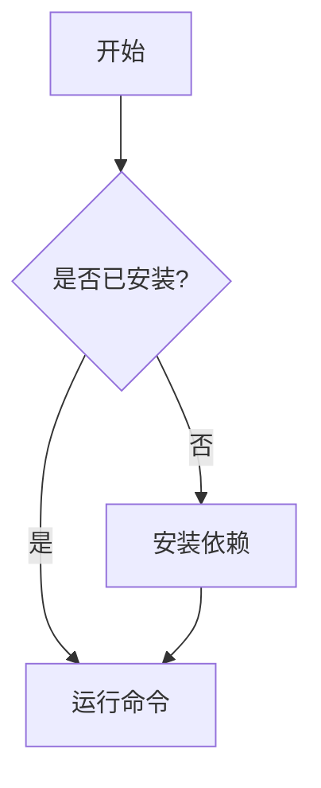

# Bilingual README Guide

## 1. Why You Need a Bilingual README

### 1.1 Documentation Needs in the Age of Globalization

In today's era of thriving open-source communities, a project's audience often extends beyond a single country or region. For Chinese developers, creating a bilingual (Chinese-English) README document offers several core benefits:

**Expand project reach:** English is the universal language of the global developer community. An excellent English README can make your project discoverable and usable by developers worldwide. According to GitHub statistics, over 70% of open-source projects use English as their primary documentation language. If your project only has a Chinese README, you are effectively giving up a large pool of potential users and contributors.

**Lower the barrier to participation:** For native Chinese speakers, a Chinese README significantly lowers the barrier to understanding and getting started. Even for developers with good English proficiency, comprehension speed and accuracy are still higher when reading technical documentation in their native language. Providing a Chinese version allows more domestic developers to quickly understand the project's value and decide whether to contribute.

**Demonstrate professionalism:** A well-maintained bilingual README signals the project team's professional attitude and international perspective to the outside world. This is especially important for commercial open-source projects, as it helps build brand trust and attracts enterprise users and sponsors.

**Improve SEO:** Search engines index documents in different languages separately. When users search for related technologies in Chinese, your Chinese README has a chance to appear in search results, bringing more organic traffic.

### 1.2 Challenges of Bilingual READMEs

Although bilingual READMEs have many benefits, they also face some challenges:

| Challenge | Description | Solution |
|------|------|----------|
| **Content Synchronization** | Two language versions need to stay consistent | Establish a translation workflow, use automation tools |
| **Maintenance Cost** | Every update requires translating twice | Use machine translation combined with human proofreading |
| **Typesetting Differences** | Chinese and English have different formatting conventions | Establish unified typesetting standards |
| **Length Differences** | Chinese is generally more concise than English | Adjust layout and formatting accordingly |
| **Terminology Consistency** | Technical terminology translations need to be unified | Create a glossary |

### 1.3 Which Projects Need a Bilingual README

Not all projects need a bilingual README. The following situations are recommended for creating bilingual versions:

- Projects targeting global developers (such as open-source tools, frameworks, and libraries)
- Projects with an international user base
- Project teams with multilingual members
- Projects hoping to attract overseas contributors
- Projects with commercialization potential

The following situations may not need a bilingual README for the time being:

- Projects targeting users in a specific region only
- Projects that are internal-use tools
- Projects with limited maintenance resources that cannot guarantee translation quality

### 1.4 Real-World Examples of Bilingual READMEs

Many well-known open-source projects have adopted bilingual or multilingual README strategies:

- **Vue.js:** Provides documentation in multiple languages, including Simplified Chinese, Japanese, Korean, and more
- **React:** The community maintains translated versions in multiple languages
- **Flutter:** Official documentation supports multiple languages
- **Ant Design:** Bilingual Chinese-English documentation is one of its distinctive features

The success of these projects demonstrates that bilingual READMEs are not only feasible but can also significantly enhance a project's international influence.

---

## 2. Bilingual README Layout Approaches

### 2.1 Approach One: Single File, Language Sections

Place both language contents in the same README file, separated by clear dividers. This approach is suitable for small projects or documentation with less content.

Structure example:

```markdown
# Project Name / 项目名称

[English](#english) | [中文](#中文)

---

## English

A modern CLI tool for managing development environments.

### Features

- Feature 1: Description
- Feature 2: Description

### Installation

```bash
npm install -g my-tool
```

---

## 中文

一个用于管理开发环境的现代化 CLI 工具。

### 功能特性

- 功能 1：描述
- 功能 2：描述

### 安装

```bash
npm install -g my-tool
```
```

**Pros:** Simple to maintain, only one file; users can switch languages on the same page; no extra file management needed.

**Cons:** The file becomes long; GitHub's language detection may be inaccurate (may identify it as a non-English project); not good for SEO; when the documentation is extensive, the file becomes very long.

### 2.2 Approach Two: Separate Files, Cross-Linked (Recommended)

Create a separate README file for each language, with language switch links at the top of each file. This is the most recommended approach.

Directory structure:

```
project-root/
├── README.md           # English version (main README)
├── README.zh-CN.md     # Simplified Chinese version
├── README.zh-TW.md     # Traditional Chinese version (optional)
├── README.ja.md        # Japanese version (optional)
└── README.ko.md        # Korean version (optional)
```

English README.md example:

```markdown
# Project Name

[](README.md)
[](README.zh-CN.md)

A modern CLI tool for managing development environments.

## Features

- Feature 1
- Feature 2
- Feature 3

## Installation

```bash
npm install -g my-tool
```

## Usage

```bash
my-tool init
my-tool deploy
```

## Contributing

We welcome contributions! Please read our Contributing Guide first.

## License

MIT
```

Chinese README.zh-CN.md example:

```markdown
# 项目名称

[](README.md)
[](README.zh-CN.md)

一个用于管理开发环境的现代化 CLI 工具。

## 功能特性

- 功能 1
- 功能 2
- 功能 3

## 安装

```bash
npm install -g my-tool
```

## 使用方法

```bash
my-tool init
my-tool deploy
```

## 贡献指南

欢迎贡献！请先阅读贡献指南。

## 许可证

MIT
```

**Pros:** Clear file structure; accurate GitHub language detection; good for SEO; each file is a reasonable size; easy to maintain independently.

**Cons:** Slightly higher maintenance cost; requires switching between multiple files; content synchronization must be ensured.

### 2.3 Approach Three: Using GitHub Native Multilingual Support

GitHub supports providing localized content for users of different languages. Create language-specific files in the `.github` directory of the repository:

```
.github/
├── CODE_OF_CONDUCT.md
├── CODE_OF_CONDUCT.zh-CN.md
├── CONTRIBUTING.md
├── CONTRIBUTING.zh-CN.md
└── ISSUE_TEMPLATE/
    ├── bug_report.yml
    └── bug_report.zh-CN.yml
```

This approach is suitable for projects that need multilingual support for multiple documents.

### 2.4 Approach Four: Using Documentation Site Tools

For projects with extensive documentation, consider using specialized documentation tools to manage multilingual documentation:

```
project-root/
├── README.md                 # Brief project introduction
├── docs/
│   ├── en/
│   │   ├── getting-started.md
│   │   ├── api-reference.md
│   │   └── examples.md
│   └── zh-CN/
│       ├── getting-started.md
│       ├── api-reference.md
│       └── examples.md
└── docusaurus.config.js      # Or VuePress, MkDocs, etc. configuration
```

Common multilingual documentation tools:

| Tool | Features | Use Case |
|------|------|----------|
| **Docusaurus** | React ecosystem, built-in multilingual support | Large project documentation |
| **VuePress** | Vue ecosystem, simple and easy to use | Small to medium project documentation |
| **MkDocs** | Python ecosystem, Markdown-friendly | Technical documentation |
| **GitBook** | Online editing, team collaboration | Commercial documentation |
| **VitePress** | Vue 3 ecosystem, extremely fast | Modern project documentation |

### 2.5 Approach Selection Guide

| Project Scale | Recommended Approach | Reason |
|----------|----------|------|
| Small projects (< 1000 lines of documentation) | Approach One | Simple to maintain, one file does it all |
| Medium projects (1000-10000 lines) | Approach Two | Clear structure, easy to maintain |
| Large projects (> 10000 lines) | Approach Four | Professional tool support, comprehensive features |
| Open-source libraries/frameworks | Approach Two + Approach Four | README uses Approach Two, detailed documentation uses Approach Four |

---

## 3. GitHub Automatic Language Detection

### 3.1 Language Detection Mechanism

GitHub uses the Linguist library to detect programming languages used in repositories. Linguist analyzes file extensions, file names, and file content to determine language types.

For README files, GitHub identifies them based on the language code in the file name:

| File Name | Language | Display |
|--------|------|------|
| README.md | English (default) | Main README |
| README.zh-CN.md | Simplified Chinese | Chinese version |
| README.zh-TW.md | Traditional Chinese | Traditional Chinese version |
| README.ja.md | Japanese | Japanese version |
| README.ko.md | Korean | Korean version |
| README.fr.md | French | French version |
| README.de.md | German | German version |
| README.es.md | Spanish | Spanish version |
| README.pt-BR.md | Brazilian Portuguese | Brazilian Portuguese version |
| README.ru.md | Russian | Russian version |

### 3.2 Optimizing Language Detection

If your repository has a large number of non-English files, it may affect GitHub's language statistics (causing the repository to be labeled as a "Chinese project" rather than an "English project"). You can adjust this through a `.gitattributes` file:

```gitattributes
# 将特定语言的 README 标记为文档（不计入语言统计）
*.zh-CN.md linguist-documentation=true
*.zh-TW.md linguist-documentation=true
*.ja.md linguist-documentation=true
*.ko.md linguist-documentation=true

# 将特定目录标记为文档
docs/** linguist-documentation=true

# 将特定文件标记为生成的代码（不计入语言统计）
src/generated/** linguist-generated=true

# 将 vendored 代码标记为非项目代码
vendor/** linguist-vendored=true
```

### 3.3 Displaying Language Switching on the Repository Homepage

GitHub automatically displays the content of README.md on the repository homepage. To allow users to switch to other language versions, you can add language switch links at the top of the README.

Create a centered language switcher using HTML format:

```html
<p align="center">
  <a href="README.md">English</a> &bull;
  <a href="README.zh-CN.md">中文</a> &bull;
  <a href="README.ja.md">日本語</a> &bull;
  <a href="README.ko.md">한국어</a>
</p>
```

### 3.4 Using shields.io Badges

Use shields.io to create language switch badges for a more visually appealing and prominent look:

```markdown
[](README.md)
[](README.zh-CN.md)
[](README.ja.md)
[](README.ko.md)
```

You can also use different styles such as flat, plastic, etc.:

```markdown


```

---

## 4. Multilingual README Organization

### 4.1 File Naming Conventions

Follow these naming conventions to maintain consistency:

```
# Basic format
README.<language-code>.md

# Language code reference (ISO 639-1 or IETF BCP 47)
README.zh-CN.md    # Simplified Chinese
README.zh-TW.md    # Traditional Chinese
README.zh-HK.md    # Hong Kong Traditional Chinese
README.en.md       # English (usually use README.md)
README.ja.md       # Japanese
README.ko.md       # Korean
README.fr.md       # French
README.de.md       # German
README.es.md       # Spanish
README.pt-BR.md    # Brazilian Portuguese
README.ru.md       # Russian
README.ar.md       # Arabic
README.it.md       # Italian
README.nl.md       # Dutch
README.pl.md       # Polish
README.th.md       # Thai
README.vi.md       # Vietnamese
```

### 4.2 Directory Structure Approaches

**Approach A: Flat Structure (Recommended)**

```
project-root/
├── README.md
├── README.zh-CN.md
├── README.ja.md
└── README.ko.md
```

Pros: Simple structure, GitHub can correctly identify files, easy to find.

**Approach B: Translations Directory Structure**

```
project-root/
├── README.md
└── translations/
    ├── README.zh-CN.md
    ├── README.ja.md
    └── README.ko.md
```

Pros: Clean root directory, translation files are centrally managed.

Cons: GitHub will not automatically recognize READMEs in the `translations` directory; they need to be manually linked in the main README.

**Approach C: Docs Directory Structure**

```
project-root/
├── README.md
└── docs/
    ├── README.zh-CN.md
    ├── README.ja.md
    └── README.ko.md
```

Suitable for projects that already use the `docs` directory to store documentation.

**Approach A is recommended** because it is the simplest, and GitHub can correctly identify the language code in the file name.

### 4.3 Internal Links in Multilingual Documentation

Ensure that links in each language version of the documentation point to files in the correct language:

```markdown
<!-- English README.md -->
## Documentation

- [Getting Started](docs/en/getting-started.md)
- [API Reference](docs/en/api-reference.md)
- [Examples](docs/en/examples.md)
- [中文文档](docs/zh-CN/getting-started.md)
```

```markdown
<!-- Chinese README.zh-CN.md -->
## 文档

- [快速开始](docs/zh-CN/getting-started.md)
- [API 参考](docs/zh-CN/api-reference.md)
- [示例](docs/zh-CN/examples.md)
- [English Documentation](docs/en/getting-started.md)
```

### 4.4 Multilingual Handling of Images and Media

For documents containing screenshots or diagrams, you can adopt the following strategies:

**Strategy One: Use Universal Images**

Use images that do not contain text, or use code-generated diagrams. For example, use Mermaid diagrams, as Mermaid can generate diagrams through code and naturally supports multilingualism:



**Strategy Two: Provide Localized Images for Each Language**

```
docs/
├── images/
│   ├── en/
│   │   ├── screenshot-1.png
│   │   └── architecture.svg
│   └── zh-CN/
│       ├── screenshot-1.png
│       └── architecture.svg
```

**Strategy Three: Use Dynamic Image Generation**

Use GitHub Actions to automatically generate screenshots and diagrams for different language versions.

---

## 5. Translation Workflow and Tools

### 5.1 Translation Workflow

Establishing an efficient translation workflow is key to maintaining a bilingual README. The recommended workflow is as follows:

```
Original document update -> Detect changes -> Machine translation -> Human proofreading -> Submit PR -> Review and merge
```

**Detailed steps:**

1. **Original document update:** The maintainer updates the English README (or primary language version)
2. **Detect changes:** Use tools to detect what content has changed, generating a diff
3. **Machine translation:** Use machine translation tools to generate an initial draft
4. **Human proofreading:** Team members or community contributors proofread the translation quality, correcting inaccurate translations
5. **Submit PR:** Submit the proofread translation as a PR
6. **Review and merge:** Maintainers review and merge the translation PR

### 5.2 Comparison of Machine Translation Tools

| Tool | Translation Quality | Price | Features | Use Case |
|------|----------|------|------|----------|
| **DeepL** | Extremely high | Paid API | Supports glossaries, most natural translation | Professional document translation |
| **Google Translate** | High | Free/Paid | Supports the most languages | Quick drafts |
| **OpenAI GPT-4** | Extremely high | Paid API | Strong context understanding, customizable | Complex technical content |
| **Claude** | Extremely high | Paid API | Excellent long text processing | Long document translation |
| **Baidu Translate** | High | Free/Paid | Good Chinese translation quality | Chinese-English translation |
| **Youdao Translate** | High | Free/Paid | Natural Chinese translation | Chinese-English translation |
| **Tencent Translate** | High | Free/Paid | Fast access within China | Chinese-English translation |
| **Alibaba Translate** | High | Free/Paid | Fast access within China | Chinese-English translation |

### 5.3 Translation Script Using GPT

A Python example script for translation using the OpenAI API:

```python
#!/usr/bin/env python3
"""
translate.py - 使用 OpenAI GPT 翻译 Markdown 文档
用法: python translate.py README.md README.zh-CN.md --source en --target zh-CN
"""

import argparse
import os
import sys

try:
    from openai import OpenAI
except ImportError:
    print("请安装 openai 库: pip install openai")
    sys.exit(1)


SYSTEM_PROMPT = """你是一个专业的技术文档翻译者。请将以下英文技术文档翻译成简体中文。

要求：
1. 保持 Markdown 格式不变
2. 技术术语保持英文或使用业界通用的中文翻译
3. 代码块不翻译
4. 保持专业、准确、流畅的风格
5. 保留所有链接和图片引用
6. 保留所有 HTML 标签
7. 不要添加任何额外的解释或注释"""


def translate_text(client, text, source_lang="English", target_lang="Simplified Chinese"):
    """翻译文本"""
    prompt = f"Translate the following {source_lang} text to {target_lang}:\n\n{text}"

    response = client.chat.completions.create(
        model="gpt-4",
        messages=[
            {"role": "system", "content": SYSTEM_PROMPT},
            {"role": "user", "content": prompt}
        ],
        temperature=0.3
    )

    return response.choices[0].message.content


def main():
    parser = argparse.ArgumentParser(description="翻译 Markdown 文档")
    parser.add_argument("input", help="输入文件路径")
    parser.add_argument("output", help="输出文件路径")
    parser.add_argument("--source", default="en", help="源语言代码")
    parser.add_argument("--target", default="zh-CN", help="目标语言代码")
    args = parser.parse_args()

    # 检查 API Key
    api_key = os.environ.get("OPENAI_API_KEY")
    if not api_key:
        print("错误: 请设置 OPENAI_API_KEY 环境变量")
        sys.exit(1)

    client = OpenAI(api_key=api_key)

    # 读取输入文件
    with open(args.input, "r", encoding="utf-8") as f:
        content = f.read()

    # 翻译
    print(f"正在翻译: {args.input} -> {args.output}")
    translated = translate_text(client, content)

    # 写入输出文件
    with open(args.output, "w", encoding="utf-8") as f:
        f.write(translated)

    print(f"翻译完成: {args.output}")


if __name__ == "__main__":
    main()
```

### 5.4 Translation Glossary

Establish a glossary and translation memory to ensure translation consistency:

```yaml
# glossary.yml - 技术术语翻译对照表
terms:
  - en: repository
    zh-CN: 仓库
    note: Git 仓库

  - en: pull request
    zh-CN: 拉取请求
    note: 可缩写为 PR，不翻译 PR 本身

  - en: branch
    zh-CN: 分支
    note: Git 分支

  - en: commit
    zh-CN: 提交
    note: Git 提交，也可指提交记录

  - en: merge
    zh-CN: 合并
    note: Git 合并操作

  - en: issue
    zh-CN: 问题
    note: GitHub Issue，有时不翻译

  - en: fork
    zh-CN: 复刻
    note: GitHub Fork，也可翻译为派生

  - en: star
    zh-CN: 点赞
    note: GitHub Star

  - en: workflow
    zh-CN: 工作流
    note: GitHub Actions 工作流

  - en: deployment
    zh-CN: 部署
    note: 项目部署

  - en: configuration
    zh-CN: 配置
    note: 项目配置

  - en: dependency
    zh-CN: 依赖
    note: 项目依赖

  - en: release
    zh-CN: 发布
    note: 版本发布

  - en: changelog
    zh-CN: 变更日志
    note: 版本变更记录

  - en: contributing guide
    zh-CN: 贡献指南
    note: 如何参与项目贡献

  - en: code of conduct
    zh-CN: 行为准则
    note: 社区行为规范

  - en: license
    zh-CN: 许可证
    note: 开源许可证

  - en: README
    zh-CN: README
    note: 不翻译，保持原样

  - en: API
    zh-CN: API
    note: 不翻译，保持原样

  - en: CLI
    zh-CN: CLI
    note: 命令行接口，通常不翻译

  - en: SDK
    zh-CN: SDK
    note: 软件开发工具包，通常不翻译

  - en: CI/CD
    zh-CN: CI/CD
    note: 持续集成/持续部署，通常不翻译
```

### 5.5 Translation Quality Check Script

Use a script to check translation quality, ensuring the document structure is consistent between both versions:

```python
#!/usr/bin/env python3
"""
check_translation.py - 检查翻译质量
用法: python check_translation.py README.md README.zh-CN.md
"""

import re
import sys


def count_pattern(text, pattern):
    """统计匹配模式的数量"""
    return len(re.findall(pattern, text, re.MULTILINE))


def check_translation(original_file, translated_file):
    """检查翻译质量"""
    with open(original_file, "r", encoding="utf-8") as f:
        original = f.read()
    with open(translated_file, "r", encoding="utf-8") as f:
        translated = f.read()

    issues = []

    # 检查标题数量
    orig_headers = count_pattern(original, r"^#{1,6}\s+.+$")
    trans_headers = count_pattern(translated, r"^#{1,6}\s+.+$")
    if orig_headers != trans_headers:
        issues.append(f"标题数量不一致: 原文 {orig_headers} 个, 译文 {trans_headers} 个")

    # 检查代码块数量
    orig_code = count_pattern(original, r"^```")
    trans_code = count_pattern(translated, r"^```")
    if orig_code != trans_code:
        issues.append(f"代码块数量不一致: 原文 {orig_code // 2} 个, 译文 {trans_code // 2} 个")

    # 检查链接数量
    orig_links = count_pattern(original, r"\[.*?\]\(.*?\)")
    trans_links = count_pattern(translated, r"\[.*?\]\(.*?\)")
    if orig_links != trans_links:
        issues.append(f"链接数量不一致: 原文 {orig_links} 个, 译文 {trans_links} 个")

    # 检查图片数量
    orig_images = count_pattern(original, r"!\[.*?\]\(.*?\)")
    trans_images = count_pattern(translated, r"!\[.*?\]\(.*?\)")
    if orig_images != trans_images:
        issues.append(f"图片数量不一致: 原文 {orig_images} 个, 译文 {trans_images} 个")

    # 检查列表项数量
    orig_lists = count_pattern(original, r"^[\-\*\d+\.]\s+.+$")
    trans_lists = count_pattern(translated, r"^[\-\*\d+\.]\s+.+$")
    if abs(orig_lists - trans_lists) > 2:  # 允许小差异
        issues.append(f"列表项数量差异较大: 原文 {orig_lists} 个, 译文 {trans_lists} 个")

    return issues


def main():
    if len(sys.argv) < 3:
        print("用法: python check_translation.py <原文文件> <译文文件>")
        sys.exit(1)

    original_file = sys.argv[1]
    translated_file = sys.argv[2]

    print(f"检查翻译质量: {original_file} vs {translated_file}")
    print("-" * 50)

    issues = check_translation(original_file, translated_file)

    if issues:
        print("发现以下问题:")
        for i, issue in enumerate(issues, 1):
            print(f"  {i}. {issue}")
        sys.exit(1)
    else:
        print("所有检查通过！翻译质量良好。")
        sys.exit(0)


if __name__ == "__main__":
    main()
```

---

## 6. GitHub Actions Automated Translation

### 6.1 Automated Translation Workflow

Create a GitHub Actions workflow that automatically triggers translation when the English README is updated:

```yaml
# .github/workflows/translate-readme.yml
name: 自动翻译 README

on:
  push:
    branches: [main]
    paths: ['README.md']

jobs:
  translate:
    runs-on: ubuntu-latest
    permissions:
      contents: write
      pull-requests: write

    steps:
      - uses: actions/checkout@v4

      - name: 设置 Python
        uses: actions/setup-python@v5
        with:
          python-version: '3.11'

      - name: 安装依赖
        run: pip install openai pyyaml

      - name: 检查变更
        id: changes
        run: |
          git diff HEAD~1 -- README.md > /tmp/changes.diff
          if [ -s /tmp/changes.diff ]; then
            echo "has_changes=true" >> $GITHUB_OUTPUT
          else
            echo "has_changes=false" >> $GITHUB_OUTPUT
          fi

      - name: 翻译 README
        if: steps.changes.outputs.has_changes == 'true'
        env:
          OPENAI_API_KEY: ${{ secrets.OPENAI_API_KEY }}
        run: |
          python scripts/translate.py README.md README.zh-CN.md

      - name: 创建 Pull Request
        if: steps.changes.outputs.has_changes == 'true'
        uses: peter-evans/create-pull-request@v5
        with:
          token: ${{ secrets.GITHUB_TOKEN }}
          commit-message: 'docs: update Chinese README translation'
          title: 'docs: 更新中文 README 翻译'
          body: |
            此 PR 由 GitHub Actions 自动生成，更新了中文 README 的翻译。

            请审查翻译质量并合并。
          branch: auto-translate/readme-zh-cn
          delete-branch: true
```

### 6.2 Using DeepL API for Translation

DeepL is currently one of the machine translation tools with the highest translation quality, especially suitable for technical document translation:

```yaml
# .github/workflows/translate-deepl.yml
name: DeepL 自动翻译

on:
  push:
    branches: [main]
    paths: ['README.md']

jobs:
  translate:
    runs-on: ubuntu-latest
    steps:
      - uses: actions/checkout@v4

      - name: 安装 DeepL CLI
        run: |
          wget https://github.com/DeepLcom/deepl-cli/releases/latest/download/deepl_linux_x86_64
          chmod +x deepl_linux_x86_64
          sudo mv deepl_linux_x86_64 /usr/local/bin/deepl

      - name: 翻译 README
        env:
          DEEPL_AUTH_KEY: ${{ secrets.DEEPL_AUTH_KEY }}
        run: |
          deepl --from EN --to ZH README.md > README.zh-CN.md

      - name: 提交翻译
        run: |
          git config user.name "github-actions[bot]"
          git config user.email "github-actions[bot]@users.noreply.github.com"
          git add README.zh-CN.md
          git diff --cached --quiet || git commit -m "docs: update Chinese README translation"
          git push
```

### 6.3 Using GitHub Actions Marketplace Translation Actions

```yaml
# .github/workflows/translate-action.yml
name: 使用社区 Action 翻译

on:
  push:
    branches: [main]
    paths: ['README.md']

jobs:
  translate:
    runs-on: ubuntu-latest
    steps:
      - uses: actions/checkout@v4

      - name: 翻译到多种语言
        uses: mefengl/auto-translate@v1
        with:
          from: 'en'
          to: 'zh-CN'
          path: 'README.md'
          output: 'README.zh-CN.md'
```

### 6.4 Automated Translation Quality Check

Automatically check translation quality in PRs:

```yaml
# .github/workflows/check-translation.yml
name: 翻译质量检查

on:
  pull_request:
    paths:
      - 'README.zh-CN.md'
      - 'README.ja.md'
      - 'README.ko.md'

jobs:
  check:
    runs-on: ubuntu-latest
    steps:
      - uses: actions/checkout@v4

      - name: 设置 Python
        uses: actions/setup-python@v5
        with:
          python-version: '3.11'

      - name: 检查翻译质量
        run: |
          python scripts/check_translation.py README.md README.zh-CN.md

      - name: 检查翻译是否过时
        run: |
          en_date=$(git log -1 --format="%at" -- README.md)
          zh_date=$(git log -1 --format="%at" -- README.zh-CN.md)
          diff=$((en_date - zh_date))
          days=$((diff / 86400))
          if [ $days -gt 30 ]; then
            echo "::warning::中文 README 已过期 ${days} 天，请及时更新翻译！"
          fi
```

---

## 7. Bilingual Documentation Maintenance Strategy

### 7.1 Maintenance Principles

**Principle One: Single Source of Truth**

Designate one primary language version as the "source of truth" (usually English), and base other language versions on it for translation. Avoid adding independent content in different language versions, as this will cause version inconsistency.

**Principle Two: Synchronized Updates**

When the primary language version is updated, other language versions should be updated within a reasonable timeframe (e.g., 1-2 weeks). Automated reminder mechanisms can be set up.

**Principle Three: Quality First**

It is better to not provide a translation than to provide a low-quality one. Low-quality machine translations can mislead users and damage the project's reputation. It is recommended to adopt a "machine translation + human proofreading" model.

**Principle Four: Community Involvement**

Encourage community contributions to translations and provide recognition for translation contributors. Translation contributors can be listed in the README:

```markdown
## 翻译贡献者

感谢以下贡献者帮助翻译本文档：

- [@contributor1](https://github.com/contributor1) - 中文翻译
- [@contributor2](https://github.com/contributor2) - 日文翻译
- [@contributor3](https://github.com/contributor3) - 韩文翻译
```

### 7.2 Version Control Strategy

Establish a clear version control strategy for documentation in different languages:

**Strategy One: Same Branch (Recommended)**

All language versions are maintained in the same branch, with changes reviewed through PRs.

**Strategy Two: Independent Branches**

Each language version is maintained in an independent branch, suitable for large teams.

**Strategy Three: Use Tags**

Tag each release to ensure documentation versions correspond to software versions.

### 7.3 Translation Update Reminders

Use GitHub Actions to periodically check if translations are outdated:

```yaml
# .github/workflows/translation-reminder.yml
name: 翻译更新提醒

on:
  schedule:
    - cron: '0 9 * * 1'  # 每周一早上 9 点

jobs:
  remind:
    runs-on: ubuntu-latest
    steps:
      - uses: actions/checkout@v4

      - name: 检查翻译是否过时
        run: |
          check_freshness() {
            local original=$1
            local translated=$2
            local lang=$3
            local threshold=$4

            en_date=$(git log -1 --format="%at" -- "$original")
            zh_date=$(git log -1 --format="%at" -- "$translated")

            if [ -z "$zh_date" ]; then
              echo "⚠️ ${lang} 版本不存在"
              return
            fi

            diff=$((en_date - zh_date))
            days=$((diff / 86400))

            if [ $days -gt $threshold ]; then
              echo "⚠️ ${lang} README 已过期 ${days} 天，请及时更新翻译！"
            else
              echo "✅ ${lang} README 更新及时（${days} 天前更新）"
            fi
          }

          check_freshness README.md README.zh-CN.md "中文" 7
          check_freshness README.md README.ja.md "日文" 14
          check_freshness README.md README.ko.md "韩文" 14
```

### 7.4 Translation Notes in the Contributing Guide

Add translation-related instructions in CONTRIBUTING.md:

```markdown
## 翻译贡献

我们欢迎社区贡献翻译！请遵循以下步骤：

1. Fork 本仓库
2. 基于英文 README 创建翻译版本
3. 确保翻译质量：
   - 保持 Markdown 格式不变
   - 代码块不翻译
   - 使用术语表中的标准翻译
   - 保留所有链接和图片引用
4. 提交 Pull Request

### 翻译规范

- 文件命名：README.<语言代码>.md
- 语言代码使用 ISO 639-1 标准
- 在文件顶部添加语言切换链接
- 保持与英文版本的结构一致

### 术语表

请参考 glossary.yml 中的术语对照表，确保翻译一致性。
```

---

## 8. Chinese-English Typesetting Standards

### 8.1 Basic Rules for Chinese Typesetting

In Chinese technical documentation, following these typesetting standards can improve readability and professionalism:

**Add spaces between Chinese and English:**

```markdown
# 不推荐
这是一个GitHub项目

# 推荐
这是一个 GitHub 项目
```

**Add spaces between numbers and Chinese:**

```markdown
# 不推荐
项目有3个主要功能

# 推荐
项目有 3 个主要功能
```

**Use full-width Chinese punctuation:**

```markdown
# 不推荐
这是一个项目.它有很多功能.

# 推荐
这是一个项目。它有很多功能。
```

**Keep proper nouns as-is:**

```markdown
# 不推荐
使用盖特进行版本控制

# 推荐
使用 Git 进行版本控制
```

**Complete punctuation reference:**

| Chinese | English | Description |
|------|------|------|
| ， | , | Comma |
| 。 | . | Period |
| ； | ; | Semicolon |
| ： | : | Colon |
| ？ | ? | Question mark |
| ！ | ! | Exclamation mark |
| （ ） | ( ) | Parentheses |
| 「 」 | " " | Quotation marks |
| 《 》 | < > | Book title marks |
| —— | -- | Dash |
| …… | ... | Ellipsis |

### 8.2 Basic Rules for English Typesetting

**Capitalize the first letter of sentences:**

```markdown
# 不推荐
this is a project.

# 推荐
This is a project.
```

**Correct capitalization of proper nouns:**

```markdown
# 不推荐
github, javascript, typescript

# 推荐
GitHub, JavaScript, TypeScript
```

**Common capitalization errors:**

| Incorrect | Correct | Description |
|------|------|------|
| github | GitHub | Company name |
| javascript | JavaScript | Language name |
| typescript | TypeScript | Language name |
| nodejs | Node.js | Runtime name |
| npm | npm | All lowercase (official convention) |
| webpack | webpack | All lowercase (official convention) |
| vuejs | Vue.js | Framework name |
| reactjs | React | Framework name |
| angularjs | Angular | Framework name |
| docker | Docker | Container platform |
| kubernetes | Kubernetes | Container orchestration |
| json | JSON | Data format |
| yaml | YAML | Data format |
| api | API | All-caps abbreviation |
| cli | CLI | All-caps abbreviation |
| ide | IDE | All-caps abbreviation |
| html | HTML | All-caps abbreviation |
| css | CSS | All-caps abbreviation |
| url | URL | All-caps abbreviation |
| http | HTTP | All-caps abbreviation |
| https | HTTPS | All-caps abbreviation |
| ssh | SSH | All-caps abbreviation |
| git | Git | Version control |
| linux | Linux | Operating system |
| macos | macOS | Operating system |
| windows | Windows | Operating system |
| ios | iOS | Operating system |
| android | Android | Operating system |

### 8.3 Code-Related Typesetting

**Use backticks for inline code:**

```markdown
使用 `npm install` 安装依赖。
```

**Specify language for code blocks:**

````markdown
```javascript
const greeting = "Hello, World!";
console.log(greeting);
```
````

**Use inline code for file paths:**

```markdown
配置文件位于 `config/settings.yml`。
```

**Use bash code blocks for command-line examples:**

````markdown
```bash
# 安装依赖
npm install

# 启动开发服务器
npm run dev
```
````

### 8.4 Links and Images

**Make link text descriptive:**

```markdown
# 不推荐
点击[这里](https://docs.example.com)查看文档。

# 推荐
查看[官方文档](https://docs.example.com)获取更多信息。
```

**Add alt text to images:**

```markdown
# 不推荐


# 推荐

```

---

## 9. Practical Templates

### 9.1 Complete English README Template

```markdown
# Project Name

[](README.md)
[](README.zh-CN.md)
[](LICENSE)
[](https://github.com/owner/repo/actions)
[](https://www.npmjs.com/package/package-name)

A brief description of what this project does and why it is useful.

## Features

- **Feature 1**: Description of feature 1
- **Feature 2**: Description of feature 2
- **Feature 3**: Description of feature 3

## Quick Start

### Prerequisites

- Node.js >= 18
- npm >= 9

### Installation

```bash
npm install package-name
```

### Usage

```javascript
import { myFunction } from 'package-name';

const result = myFunction();
console.log(result);
```

## Documentation

- [Getting Started](docs/getting-started.md)
- [API Reference](docs/api-reference.md)
- [Examples](docs/examples.md)
- [FAQ](docs/faq.md)

## Contributing

Contributions are welcome! Please read our [Contributing Guide](CONTRIBUTING.md) first.

## License

[MIT](LICENSE)

## Acknowledgments

- Thanks to all [contributors](https://github.com/owner/repo/graphs/contributors)
- Inspired by [other-project](https://github.com/other/project)
```

### 9.2 Complete Chinese README Template

```markdown
# 项目名称

[](README.md)
[](README.zh-CN.md)
[](LICENSE)
[](https://github.com/owner/repo/actions)
[](https://www.npmjs.com/package/package-name)

简要描述这个项目做什么以及为什么有用。

## 功能特性

- **功能 1**：功能 1 的描述
- **功能 2**：功能 2 的描述
- **功能 3**：功能 3 的描述

## 快速开始

### 环境要求

- Node.js >= 18
- npm >= 9

### 安装

```bash
npm install package-name
```

### 使用方法

```javascript
import { myFunction } from 'package-name';

const result = myFunction();
console.log(result);
```

## 文档

- [快速开始](docs/zh-CN/getting-started.md)
- [API 参考](docs/zh-CN/api-reference.md)
- [示例](docs/zh-CN/examples.md)
- [常见问题](docs/zh-CN/faq.md)

## 贡献指南

欢迎贡献！请先阅读[贡献指南](CONTRIBUTING.md)。

## 许可证

[MIT](LICENSE)

## 致谢

- 感谢所有[贡献者](https://github.com/owner/repo/graphs/contributors)
- 灵感来源于 [other-project](https://github.com/other/project)
```

### 9.3 Complete Example of a Multilingual README

Here is a complete example of a multilingual README project's directory structure and file contents:

```
my-project/
├── README.md                 # English version
├── README.zh-CN.md           # Simplified Chinese version
├── README.ja.md              # Japanese version
├── .gitattributes            # Language detection configuration
├── glossary.yml              # Glossary
├── scripts/
│   ├── translate.py          # Translation script
│   └── check_translation.py  # Quality check script
├── .github/
│   └── workflows/
│       ├── translate.yml     # Automated translation workflow
│       └── check.yml         # Quality check workflow
└── docs/
    ├── en/
    │   └── ...
    └── zh-CN/
        └── ...
```

### 9.4 Building a Multilingual Documentation Site with Docusaurus

For projects that need more comprehensive multilingual support, Docusaurus is recommended:

```javascript
// docusaurus.config.js
module.exports = {
  title: 'My Project',
  tagline: 'A modern tool for developers',
  url: 'https://my-project.com',
  baseUrl: '/',

  i18n: {
    defaultLocale: 'en',
    locales: ['en', 'zh-CN', 'ja', 'ko'],
    localeConfigs: {
      en: { label: 'English' },
      'zh-CN': { label: '简体中文' },
      ja: { label: '日本語' },
      ko: { label: '한국어' },
    },
  },

  themeConfig: {
    navbar: {
      items: [
        {
          type: 'localeDropdown',
          position: 'right',
        },
      ],
    },
  },
};
```

Corresponding directory structure:

```
docs/
├── intro.md              # English version
├── getting-started.md    # English version
i18n/
├── zh-CN/
│   ├── docusaurus-plugin-content-docs/
│   │   └── current/
│   │       ├── intro.md
│   │       └── getting-started.md
│   └── docusaurus-theme-classic/
│       └── navbar.json
├── ja/
│   └── ...
└── ko/
    └── ...
```

### 9.5 Best Practices Summary

1. **Choose the right approach:** Select the most suitable multilingual approach based on project scale and team capabilities
2. **Maintain structural consistency:** All language versions should have the same section structure
3. **Use a glossary:** Establish a unified terminology translation table to ensure consistency
4. **Automate translation:** Use GitHub Actions to automate the translation process
5. **Quality checks:** Use scripts to automatically check translation quality
6. **Community involvement:** Encourage community translation contributions to reduce maintenance burden
7. **Regular updates:** Set up reminder mechanisms to ensure translations do not become outdated
8. **Typesetting standards:** Follow Chinese-English typesetting standards to improve document professionalism
9. **SEO optimization:** Use the separate file approach for easier search engine indexing
10. **Badge switching:** Add prominent language switch links at the top of the README

---

## Summary

A bilingual README is an important step in the internationalization of open-source projects. Through the methods and tools introduced in this article, you can:

1. **Choose the right layout approach:** Select single-file or multi-file approach based on project scale
2. **Leverage GitHub features:** Use file naming conventions for GitHub to recognize multilingual versions
3. **Establish a translation workflow:** Use machine translation combined with human proofreading to improve efficiency
4. **Automate the translation process:** Use GitHub Actions to automate translation
5. **Ensure translation quality:** Use quality check scripts to ensure structural consistency
6. **Follow typesetting standards:** Standardize Chinese-English typesetting to improve document professionalism

Remember, a good bilingual README is not just about translation -- it is a sign of respect and invitation to developers around the world. Investing time and effort in maintaining high-quality multilingual documentation will bring broader influence and more contributors to your project.

## 10. Advanced Topics and Techniques

### 10.1 Using GitHub Discussions for Multilingual Community Management

In addition to README files, GitHub Discussions is also an important venue for multilingual community management:

```yaml
# .github/DISCUSSION_CATEGORY.yml
- name: Q&A / 问答
  description: Ask questions and get help / 提问和获取帮助
  emoji: "💬"

- name: Ideas / 想法
  description: Share your ideas / 分享你的想法
  emoji: "💡"

- name: Show and Tell / 展示
  description: Show off your projects / 展示你的项目
  emoji: "🎉"
```

### 10.2 Multilingual Contributing Guide

Provide dedicated contributing guides for contributors of different languages:

```markdown
# CONTRIBUTING.md

## 贡献指南 / Contributing Guide

[English](#english) | [中文](#中文)

---

### English

Welcome! We're excited that you want to contribute.

#### How to Contribute

1. Fork the repository
2. Create a feature branch
3. Make your changes
4. Submit a Pull Request

#### Translation Contributions

We welcome translations! Please follow these guidelines:
- Use the template from `docs/translations/template.md`
- Maintain the same structure as the English version
- Don't translate code blocks
- Use the glossary in `glossary.yml` for consistent terminology

---

### 中文

欢迎！我们很高兴你想参与贡献。

#### 如何贡献

1. 复刻（Fork）本仓库
2. 创建功能分支
3. 进行修改
4. 提交拉取请求（Pull Request）

#### 翻译贡献

我们欢迎翻译贡献！请遵循以下指南：
- 使用 `docs/translations/template.md` 中的模板
- 保持与英文版本相同的结构
- 不要翻译代码块
- 使用 `glossary.yml` 中的术语表确保翻译一致性
```

### 10.3 Automated Translation Quality Assurance

Establish a comprehensive automated translation quality assurance system:

```yaml
# .github/workflows/translation-quality.yml
name: Translation Quality Assurance

on:
  pull_request:
    paths:
      - 'README*.md'
      - 'docs/**/*.md'

jobs:
  quality-check:
    runs-on: ubuntu-latest
    steps:
      - uses: actions/checkout@v4

      - name: Check Translation Consistency
        run: |
          # 检查所有翻译版本的结构一致性
          for translated in README.zh-CN.md README.ja.md README.ko.md; do
            if [ -f "$translated" ]; then
              echo "检查 $translated..."

              # 检查标题数量
              en_headers=$(grep -c '^#' README.md)
              trans_headers=$(grep -c '^#' "$translated")
              if [ "$en_headers" != "$trans_headers" ]; then
                echo "::warning file=$translated::标题数量不一致: 英文 $en_headers, 翻译 $trans_headers"
              fi

              # 检查代码块数量
              en_code=$(grep -c '```' README.md)
              trans_code=$(grep -c '```' "$translated")
              if [ "$en_code" != "$trans_code" ]; then
                echo "::warning file=$translated::代码块数量不一致: 英文 $en_code, 翻译 $trans_code"
              fi
            fi
          done

      - name: Check Terminology Consistency
        run: |
          # 检查术语翻译是否与术语表一致
          if [ -f glossary.yml ]; then
            echo "检查术语一致性..."
            # 使用 Python 脚本进行术语检查
            python scripts/check_terminology.py
          fi

      - name: Check Link Validity
        run: |
          # 检查翻译版本中的链接是否有效
          for translated in README.zh-CN.md README.ja.md README.ko.md; do
            if [ -f "$translated" ]; then
              echo "检查 $translated 中的链接..."
              # 提取并验证链接
              grep -oP '\[.*?\]\((.*?)\)' "$translated" | while read -r link; do
                url=$(echo "$link" | grep -oP '\((.*?)\)' | tr -d '()')
                if [[ "$url" == http* ]]; then
                  curl -s -o /dev/null -w "%{http_code}" "$url" | grep -q "200\|301\|302" || \
                    echo "::warning file=$translated::链接可能无效: $url"
                fi
              done
            fi
          done
```

### 10.4 Multilingual SEO Optimization

Perform SEO optimization for documentation in different language versions:

```html
<!-- 在 README.md 中添加 SEO 相关的 HTML 标签 -->
<!-- 注意：GitHub 会过滤大部分 HTML 标签，但以下标签是支持的 -->

<p align="center">
  <strong>A modern CLI tool for managing development environments</strong>
</p>

<p align="center">
  <a href="README.md">English</a> |
  <a href="README.zh-CN.md">中文</a> |
  <a href="README.ja.md">日本語</a>
</p>
```

Use `.gitattributes` to optimize GitHub's language recognition:

```gitattributes
# 告诉 GitHub 这些文件是文档，不应计入语言统计
README.zh-CN.md linguist-documentation=true
README.ja.md linguist-documentation=true
README.ko.md linguist-documentation=true

# 确保 GitHub 正确识别项目的主要语言
*.js linguist-detectable=true
*.ts linguist-detectable=true
```

### 10.5 Internationalized Documentation Site Architecture

For large projects, establish a comprehensive internationalized documentation site architecture:

```
project/
├── website/
│   ├── i18n/
│   │   ├── en/
│   │   │   ├── docusaurus-plugin-content-docs/
│   │   │   │   └── current/
│   │   │   │       ├── getting-started.md
│   │   │   │       ├── api-reference.md
│   │   │   │       └── examples.md
│   │   │   └── docusaurus-theme-classic/
│   │   │       ├── navbar.json
│   │   │       └── footer.json
│   │   ├── zh-CN/
│   │   │   ├── docusaurus-plugin-content-docs/
│   │   │   │   └── current/
│   │   │   │       ├── getting-started.md
│   │   │   │       ├── api-reference.md
│   │   │   │       └── examples.md
│   │   │   └── docusaurus-theme-classic/
│   │   │       ├── navbar.json
│   │   │       └── footer.json
│   │   └── ja/
│   │       └── ...
│   ├── src/
│   ├── static/
│   ├── docusaurus.config.js
│   └── package.json
├── README.md
└── README.zh-CN.md
```

Docusaurus multilingual configuration example:

```javascript
// docusaurus.config.js
module.exports = {
  i18n: {
    defaultLocale: 'en',
    locales: ['en', 'zh-CN', 'ja'],
    localeConfigs: {
      en: {
        label: 'English',
        direction: 'ltr',
        htmlLang: 'en-US',
      },
      'zh-CN': {
        label: '简体中文',
        direction: 'ltr',
        htmlLang: 'zh-CN',
      },
      ja: {
        label: '日本語',
        direction: 'ltr',
        htmlLang: 'ja',
      },
    },
  },
  themeConfig: {
    navbar: {
      items: [
        {
          type: 'localeDropdown',
          position: 'right',
        },
      ],
    },
  },
};
```

### 10.6 Translation Memory and Terminology Management

Establish enterprise-level translation memory and terminology management systems:

```yaml
# glossary.yml - 完整的术语管理文件
metadata:
  project: "My Project"
  version: "1.0"
  last_updated: "2024-01-15"

terms:
  # Git 相关术语
  - en: repository
    zh-CN: 仓库
    ja: リポジトリ
    ko: 저장소
    context: Git repository
    notes: 不翻译时保持 "repository"

  - en: commit
    zh-CN: 提交
    ja: コミット
    ko: 커밋
    context: Git commit
    notes: 作为名词时翻译为"提交"或"提交记录"

  - en: pull request
    zh-CN: 拉取请求
    ja: プルリクエスト
    ko: 풀 리퀘스트
    context: GitHub Pull Request
    notes: 可缩写为 PR，不翻译 PR 本身

  - en: branch
    zh-CN: 分支
    ja: ブランチ
    ko: 브랜치
    context: Git branch

  - en: merge
    zh-CN: 合并
    ja: マージ
    ko: 머지
    context: Git merge

  - en: fork
    zh-CN: 复刻
    ja: フォーク
    ko: 포크
    context: GitHub Fork
    notes: 也可翻译为"派生"

  - en: issue
    zh-CN: 问题
    ja: イシュー
    ko: 이슈
    context: GitHub Issue
    notes: 有时不翻译，保持 "Issue"

  - en: star
    zh-CN: 点赞
    ja: スター
    ko: 스타
    context: GitHub Star

  # 技术术语
  - en: API
    zh-CN: API
    ja: API
    ko: API
    notes: 不翻译，保持原样

  - en: CLI
    zh-CN: CLI
    ja: CLI
    ko: CLI
    context: Command Line Interface
    notes: 不翻译，保持原样

  - en: SDK
    zh-CN: SDK
    ja: SDK
    ko: SDK
    context: Software Development Kit
    notes: 不翻译，保持原样

  - en: CI/CD
    zh-CN: CI/CD
    ja: CI/CD
    ko: CI/CD
    context: Continuous Integration/Continuous Deployment
    notes: 不翻译，保持原样

  - en: container
    zh-CN: 容器
    ja: コンテナ
    ko: 컨테이너
    context: Docker container

  - en: deployment
    zh-CN: 部署
    ja: デプロイメント
    ko: 배포
    context: Application deployment

  - en: configuration
    zh-CN: 配置
    ja: 設定
    ko: 구성
    context: System configuration

  - en: dependency
    zh-CN: 依赖
    ja: 依存関係
    ko: 의존성
    context: Package dependency

  - en: release
    zh-CN: 发布
    ja: リリース
    ko: 릴리스
    context: Version release

  - en: changelog
    zh-CN: 变更日志
    ja: 変更履歴
    ko: 변경 로그
    context: Version changelog

  - en: contributing guide
    zh-CN: 贡献指南
    ja: コントリビューションガイド
    ko: 기여 가이드
    context: How to contribute

  - en: code of conduct
    zh-CN: 行为准则
    ja: 行動規範
    ko: 행동 강령
    context: Community code of conduct

  - en: license
    zh-CN: 许可证
    ja: ライセンス
    ko: 라이선스
    context: Open source license
```

### 10.7 Translation Contributor Recognition System

Establish a comprehensive translation contributor recognition system to motivate community participation in translation:

```markdown
## Translation Contributors / 翻译贡献者

We thank the following contributors for their translation work:
感谢以下贡献者的翻译工作：

### 简体中文 (Simplified Chinese)
- [@contributor1](https://github.com/contributor1) - Main translator / 主要翻译者
- [@contributor2](https://github.com/contributor2) - Reviewer / 审校者
- [@contributor3](https://github.com/contributor3) - Contributor / 贡献者

### 日本語 (Japanese)
- [@contributor4](https://github.com/contributor4) - Main translator / 主要翻訳者
- [@contributor5](https://github.com/contributor5) - Reviewer / レビュアー

### 한국어 (Korean)
- [@contributor6](https://github.com/contributor6) - Main translator / 주요 번역자

---

Want to help translate? See our [Translation Guide](docs/translations/README.md).
想帮助翻译？请查看我们的[翻译指南](docs/translations/README.md)。
```

### 10.8 Testing Strategy for Multilingual Documentation

Establish a testing strategy for multilingual documentation to ensure translation quality:

```python
#!/usr/bin/env python3
"""
test_translations.py - 翻译质量测试
"""

import os
import re
import pytest


def get_readme_files():
    """获取所有 README 文件"""
    files = []
    for f in os.listdir('.'):
        if f.startswith('README') and f.endswith('.md'):
            files.append(f)
    return files


def count_pattern(content, pattern):
    """统计匹配模式的数量"""
    return len(re.findall(pattern, content, re.MULTILINE))


def read_file(filepath):
    """读取文件内容"""
    with open(filepath, 'r', encoding='utf-8') as f:
        return f.read()


class TestTranslationQuality:
    """翻译质量测试类"""

    @pytest.fixture
    def english_readme(self):
        return read_file('README.md')

    @pytest.fixture
    def translated_readmes(self):
        files = {}
        for f in get_readme_files():
            if f != 'README.md':
                files[f] = read_file(f)
        return files

    def test_headers_count(self, english_readme, translated_readmes):
        """测试标题数量一致性"""
        en_count = count_pattern(english_readme, r'^#{1,6}\s+.+$')
        for filename, content in translated_readmes.items():
            trans_count = count_pattern(content, r'^#{1,6}\s+.+$')
            assert en_count == trans_count, \
                f"{filename}: 标题数量不一致 (英文: {en_count}, 翻译: {trans_count})"

    def test_code_blocks_count(self, english_readme, translated_readmes):
        """测试代码块数量一致性"""
        en_count = count_pattern(english_readme, r'^```') // 2
        for filename, content in translated_readmes.items():
            trans_count = count_pattern(content, r'^```') // 2
            assert en_count == trans_count, \
                f"{filename}: 代码块数量不一致 (英文: {en_count}, 翻译: {trans_count})"

    def test_links_count(self, english_readme, translated_readmes):
        """测试链接数量一致性"""
        en_count = count_pattern(english_readme, r'\[.*?\]\(.*?\)')
        for filename, content in translated_readmes.items():
            trans_count = count_pattern(content, r'\[.*?\]\(.*?\)')
            # 允许小差异（语言切换链接）
            assert abs(en_count - trans_count) <= 2, \
                f"{filename}: 链接数量差异过大 (英文: {en_count}, 翻译: {trans_count})"

    def test_no_untranslated_headers(self, translated_readmes):
        """测试没有未翻译的标题"""
        for filename, content in translated_readmes.items():
            # 检查是否有纯英文标题（可能是忘记翻译的）
            headers = re.findall(r'^#+\s+(.+)$', content, re.MULTILINE)
            for header in headers:
                # 如果标题完全是英文字母和空格，可能是忘记翻译
                if re.match(r'^[A-Za-z\s]+$', header.strip()):
                    # 但要排除常见的英文标题（如 API、FAQ 等）
                    if header.strip() not in ['API', 'FAQ', 'CLI', 'SDK', 'CI/CD']:
                        pytest.warn(f"{filename}: 标题可能未翻译: {header}")


if __name__ == '__main__':
    pytest.main([__file__, '-v'])
```

### 10.9 Best Practices for AI-Assisted Translation

Combine AI tools to improve translation efficiency and quality:

```python
#!/usr/bin/env python3
"""
ai_translate.py - 使用 AI 进行智能翻译
"""

import os
import json
from typing import List, Dict

try:
    from openai import OpenAI
except ImportError:
    print("请安装 openai 库: pip install openai")
    exit(1)


class AITranslator:
    """AI 翻译器"""

    def __init__(self, glossary_path: str = "glossary.yml"):
        self.client = OpenAI(api_key=os.environ.get("OPENAI_API_KEY"))
        self.glossary = self._load_glossary(glossary_path)

    def _load_glossary(self, path: str) -> Dict:
        """加载术语表"""
        import yaml
        if os.path.exists(path):
            with open(path, 'r', encoding='utf-8') as f:
                return yaml.safe_load(f)
        return {"terms": []}

    def _build_glossary_prompt(self) -> str:
        """构建术语表提示"""
        if not self.glossary.get("terms"):
            return ""

        lines = ["术语对照表:"]
        for term in self.glossary["terms"]:
            en = term.get("en", "")
            zh = term.get("zh-CN", "")
            if en and zh:
                lines.append(f"- {en} -> {zh}")

        return "\n".join(lines)

    def translate(self, text: str, source_lang: str = "English",
                  target_lang: str = "Simplified Chinese") -> str:
        """翻译文本"""
        glossary_prompt = self._build_glossary_prompt()

        system_prompt = f"""你是一个专业的技术文档翻译者。请将以下{source_lang}技术文档翻译成{target_lang}。

要求：
1. 保持 Markdown 格式不变
2. 技术术语保持英文或使用业界通用的中文翻译
3. 代码块不翻译
4. 保持专业、准确、流畅的风格
5. 保留所有链接和图片引用
6. 保留所有 HTML 标签
7. 不要添加任何额外的解释或注释

{glossary_prompt}"""

        response = self.client.chat.completions.create(
            model="gpt-4",
            messages=[
                {"role": "system", "content": system_prompt},
                {"role": "user", "content": f"请翻译以下内容:\n\n{text}"}
            ],
            temperature=0.3
        )

        return response.choices[0].message.content


def main():
    """主函数"""
    import argparse

    parser = argparse.ArgumentParser(description="AI 翻译工具")
    parser.add_argument("input", help="输入文件路径")
    parser.add_argument("output", help="输出文件路径")
    parser.add_argument("--glossary", default="glossary.yml", help="术语表路径")
    args = parser.parse_args()

    translator = AITranslator(args.glossary)

    with open(args.input, 'r', encoding='utf-8') as f:
        content = f.read()

    print(f"正在翻译: {args.input}")
    translated = translator.translate(content)

    with open(args.output, 'w', encoding='utf-8') as f:
        f.write(translated)

    print(f"翻译完成: {args.output}")


if __name__ == "__main__":
    main()
```

---

## Summary

A bilingual README is an important step in the internationalization of open-source projects. Through the methods and tools introduced in this article, you can:

1. **Choose the right layout approach:** Select single-file or multi-file approach based on project scale; the separate file approach is recommended
2. **Leverage GitHub features:** Use file naming conventions for GitHub to recognize multilingual versions; optimize language detection through `.gitattributes`
3. **Establish a translation workflow:** Use machine translation combined with human proofreading to improve efficiency; create a glossary to ensure consistency
4. **Automate the translation process:** Use GitHub Actions to automate translation; set up quality checks and update reminders
5. **Ensure translation quality:** Use quality check scripts to ensure structural consistency; establish testing strategies to verify translation quality
6. **Follow typesetting standards:** Standardize Chinese-English typesetting to improve document professionalism and readability
7. **Build community recognition:** Provide recognition for translation contributors to motivate community participation in translation work
8. **Continuously optimize and improve:** Regularly review translation quality and continuously optimize the translation process based on feedback

Remember, a good bilingual README is not just about translation -- it is a sign of respect and invitation to developers around the world. Investing time and effort in maintaining high-quality multilingual documentation will bring broader influence and more contributors to your project. In practice, it is recommended to start with core documentation and gradually expand to complete multilingual support while establishing a sustainable translation maintenance mechanism.

## 11. Appendix: Multilingual Documentation Tools and Resources

### 11.1 Recommended Translation Tools

| Tool Name | Type | Features | Use Case |
|----------|------|------|----------|
| DeepL | Online/API | Highest translation quality | Professional document translation |
| Google Translate | Online/API | Supports the most languages | Quick drafts |
| OpenAI GPT-4 | API | Strong context understanding | Complex technical content |
| Claude | API | Excellent long text processing | Long document translation |
| Baidu Translate | Online/API | Good Chinese translation | Chinese-English translation |
| Youdao Translate | Online/API | Natural Chinese | Chinese-English translation |
| Crowdin | Platform | Professional translation management | Large projects |
| Transifex | Platform | Team collaboration | Commercial projects |
| Lokalise | Platform | Mobile app friendly | Application localization |

### 11.2 Recommended Documentation Tools

| Tool Name | Features | Multilingual Support | Use Case |
|----------|------|-----------|----------|
| Docusaurus | React ecosystem, comprehensive features | Built-in multilingual | Large project documentation |
| VuePress | Vue ecosystem, simple and easy to use | Plugin support | Small to medium projects |
| VitePress | Vue 3 ecosystem, extremely fast | Plugin support | Modern project documentation |
| MkDocs | Python ecosystem, Markdown-friendly | Plugin support | Technical documentation |
| GitBook | Online editing, team collaboration | Built-in multilingual | Commercial documentation |
| Sphinx | Python ecosystem, powerful features | Built-in multilingual | Python projects |

### 11.3 Recommended Typesetting Check Tools

| Tool Name | Function | Supported Languages |
|----------|------|----------|
| markdownlint | Markdown format checking | All languages |
| textlint | Natural language checking | Multilingual support |
| proselint | English writing checking | English |
| write-good | English writing style checking | English |
| pangu.js | Adding spaces between Chinese and English | Chinese-English mixed |

### 11.4 Common Language Code Reference

| Language Code | Language Name | Filename Example |
|----------|----------|-----------|
| en | English | README.md |
| zh-CN | Simplified Chinese | README.zh-CN.md |
| zh-TW | Traditional Chinese | README.zh-TW.md |
| ja | Japanese | README.ja.md |
| ko | Korean | README.ko.md |
| fr | French | README.fr.md |
| de | German | README.de.md |
| es | Spanish | README.es.md |
| pt-BR | Brazilian Portuguese | README.pt-BR.md |
| ru | Russian | README.ru.md |
| ar | Arabic | README.ar.md |
| it | Italian | README.it.md |
| nl | Dutch | README.nl.md |
| pl | Polish | README.pl.md |
| th | Thai | README.th.md |
| vi | Vietnamese | README.vi.md |
| hi | Hindi | README.hi.md |
| tr | Turkish | README.tr.md |

### 11.5 shields.io Badge Style Reference

```markdown
# 默认样式


# for-the-badge 样式


# flat-square 样式


# plastic 样式


# 带 Logo


# 带链接
[](README.md)
```

### 11.6 Translation Quality Check Script

```python
#!/usr/bin/env python3
"""
check_all_translations.py - 检查所有翻译版本的质量
"""

import os
import re
import sys


def get_translation_files():
    """获取所有翻译文件"""
    files = []
    for f in os.listdir('.'):
        if f.startswith('README') and f.endswith('.md') and f != 'README.md':
            files.append(f)
    return files


def count_pattern(content, pattern):
    """统计匹配模式的数量"""
    return len(re.findall(pattern, content, re.MULTILINE))


def check_single_translation(original, translated, filename):
    """检查单个翻译文件"""
    issues = []

    # 检查标题数量
    orig_headers = count_pattern(original, r'^#{1,6}\s+.+$')
    trans_headers = count_pattern(translated, r'^#{1,6}\s+.+$')
    if orig_headers != trans_headers:
        issues.append(f"标题数量不一致: 原文 {orig_headers}, 翻译 {trans_headers}")

    # 检查代码块数量
    orig_code = count_pattern(original, r'^```')
    trans_code = count_pattern(translated, r'^```')
    if orig_code != trans_code:
        issues.append(f"代码块数量不一致: 原文 {orig_code // 2}, 翻译 {trans_code // 2}")

    # 检查链接数量
    orig_links = count_pattern(original, r'\[.*?\]\(.*?\)')
    trans_links = count_pattern(translated, r'\[.*?\]\(.*?\)')
    if abs(orig_links - trans_links) > 2:
        issues.append(f"链接数量差异过大: 原文 {orig_links}, 翻译 {trans_links}")

    # 检查图片数量
    orig_images = count_pattern(original, r'!\[.*?\]\(.*?\)')
    trans_images = count_pattern(translated, r'!\[.*?\]\(.*?\)')
    if orig_images != trans_images:
        issues.append(f"图片数量不一致: 原文 {orig_images}, 翻译 {trans_images}")

    return issues


def main():
    """主函数"""
    # 读取英文 README
    if not os.path.exists('README.md'):
        print("错误: 找不到 README.md 文件")
        sys.exit(1)

    with open('README.md', 'r', encoding='utf-8') as f:
        original = f.read()

    # 获取所有翻译文件
    translation_files = get_translation_files()
    if not translation_files:
        print("没有找到翻译文件")
        sys.exit(0)

    print(f"找到 {len(translation_files)} 个翻译文件: {', '.join(translation_files)}")
    print("-" * 50)

    all_passed = True
    for filename in translation_files:
        with open(filename, 'r', encoding='utf-8') as f:
            translated = f.read()

        issues = check_single_translation(original, translated, filename)

        if issues:
            all_passed = False
            print(f"\n{filename}:")
            for issue in issues:
                print(f"  ⚠️ {issue}")
        else:
            print(f"\n{filename}: ✅ 所有检查通过")

    print("-" * 50)
    if all_passed:
        print("所有翻译文件质量检查通过！")
        sys.exit(0)
    else:
        print("部分翻译文件存在问题，请检查并修复。")
        sys.exit(1)


if __name__ == "__main__":
    main()
```

---

**Previous: [GitHub Practical Project Examples](V-practical-examples.md) | Next: [GitHub Educational Resources](W-education.md)**
